# Reader module: the pipe and the reading list

*2026-09-18T12:51:47.240Z*

ALF-233 builds the Reader's pipe end to end and gives the owner a reading list: the schema, the module shell, intake and extraction from the comms mirror, the Sonnet 5 summariser, the list with its two verbs, and the one Comms change the epic sanctions.

The summariser itself needs a key and a real mailbox, so it belongs to the checkpoint (spec §12). Everything below runs with no key, no bill and no network: the extractor against committed fixtures, and the UI driven through the in-memory Supabase mock the E2E harness boots.

## 1 · Extraction, from real newsletter mail

The eval script replays four committed Gmail `messages.get` fixtures through the same extractor the tick uses. Each block is what the pipe would write to `reader_posts`: title from the Subject, author from the From display name, the canonical URL by B8's rule (first `/p/` link on any host, else a "view in browser" anchor, else the mailbox fallback), the word count off the stored text, and whether HTML was found at all.

```bash
npm run eval:reader -w workers -- --fixtures --dry-run 2>/dev/null
```

```output

> workers@0.0.0 eval:reader
> node --import ./scripts/ts-resolve.mjs scripts/reader-eval.ts --fixtures --dry-run

reader eval — 4 fixtures, extraction only

essay
  publication    Mira Vantz
  title          The Grain Ledger
  author         Mira Vantz
  canonical URL  https://harborline.substack.com/p/the-grain-ledger
  word count     278
  html_extracted true

roundup-view-in-browser
  publication    The Cadence Weekly
  title          Ten links, one argument
  author         The Cadence Weekly
  canonical URL  https://cadence.substack.com/i/149023188/9f2a?utm_source=email
  word count     98
  html_extracted true

plain-text-only
  publication    tallowfield
  title          Notes from the third week
  author         tallowfield
  canonical URL  none → mailbox
  word count     190
  html_extracted false

platform-mail
  publication    Substack
  title          Your weekly Substack digest
  author         Substack
  canonical URL  none → mailbox
  word count     33
  html_extracted true
```

The third fixture is plain-text-only mail — no HTML part, so `html_extracted` is false and there is no anchor to take a canonical URL from; it falls back to the mailbox permalink. The second is an older template whose only post link is behind a tracking host, reached through the "view in browser" anchor.

## 2 · The reading list, populated

The live app at `/reader`, seeded with `readerFixtureSet()` — one post per row state the story renders. Reading down: a done post with no link at all (`Open` disabled), `summary refused`, `summary failed`, `summarising…`, and two done posts with their gists. The heading carries "6 to read" and the nav badge the same 6; the switcher has grown its fourth segment.

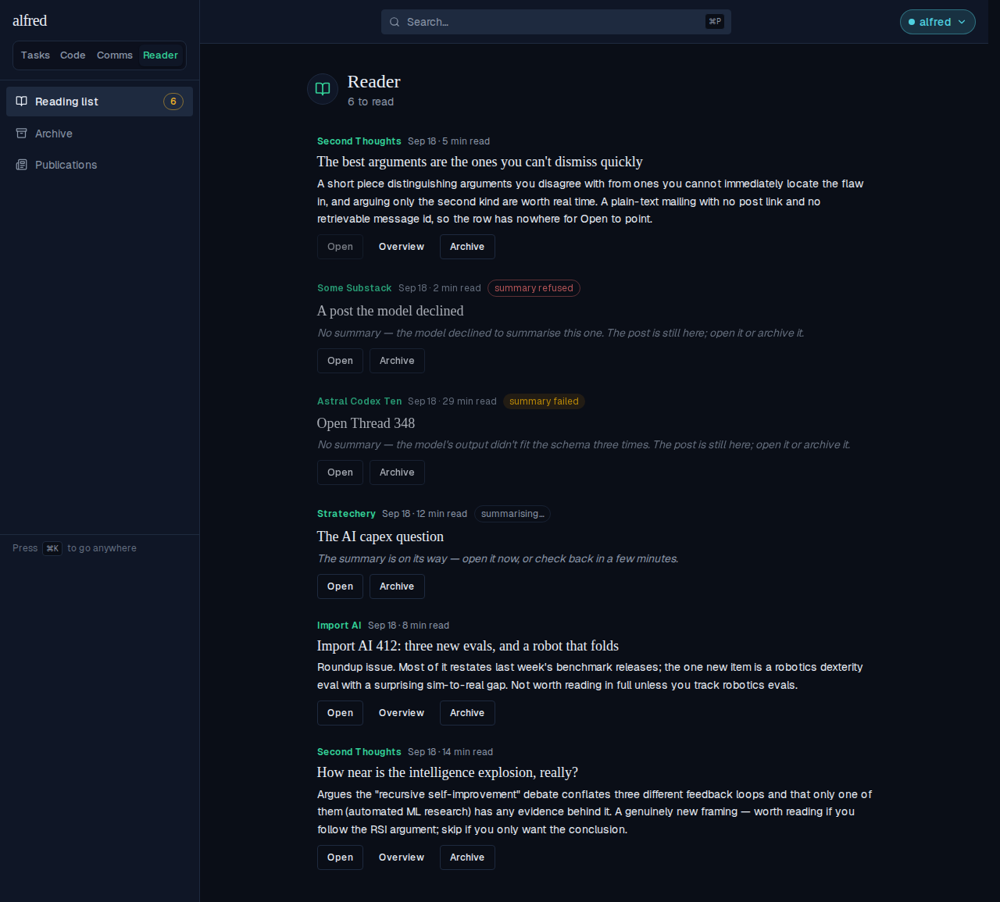

## 3 · The overview

`Overview` expands the row in place into the model's four sections. Before — the row at rest, gist only:

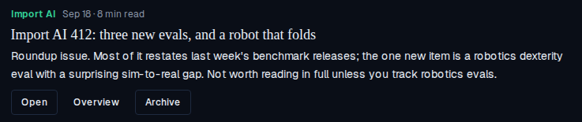

After the click: the row takes the green border and the secondary wash, the verb becomes `Hide overview`, and Novel ideas / Evidence / The argument / Who should read it stack underneath.

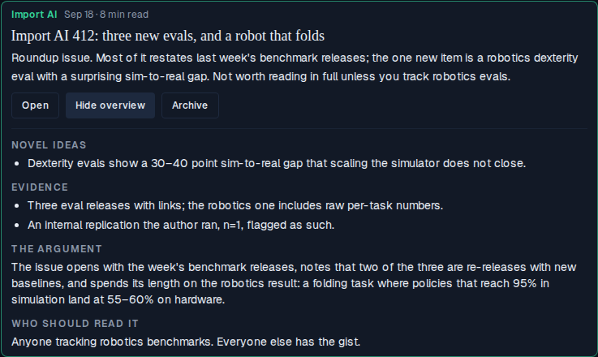

## 4 · Archive

Archiving is an animation — the row fades and collapses before the mutation commits, so the list never jumps — which a still cannot show. Recorded live: three posts, `Archive` on the middle one, and the count falling from 3 to 2 as the row leaves.


## 5 · Open — canonical URL, or the mailbox fallback

`Open` is a real anchor, never a handler, so the owner can middle-click it. Where it points is B8's rule and D12's fallback. Both hrefs below were read straight off the rendered rows in the live list:

```bash
cat docs/demos/reader-pipe-and-list/open-hrefs.txt
```

```output
The Open verb, as it renders in the live list — read off each row’s anchor.

How near is the intelligence explosion, really?   (canonical_url set)
  href = https://secondthoughts.substack.com/p/how-near-is-the-intelligence-explosion

Import AI 412: three new evals, and a robot that folds   (canonical_url null,
  rfc822_message_id <import-ai-412@mail.substack.com>) -> the Gmail permalink
  href = https://mail.google.com/mail/u/0/#search/rfc822msgid:import-ai-412%40mail.substack.com
```

The mailbox row has no canonical URL, so the href is the Gmail `rfc822msgid:` search over its Message-ID with the angle brackets stripped and the value URL-encoded. The sixth fixture post has neither, and its `Open` renders disabled with a title saying why rather than disappearing — visible in the first screenshot.

## 6 · The phone, 390 × 844

Nothing in this story is desktop-only. The same rows, the same verbs, reached by touch — the verb row wraps and the gist reflows:

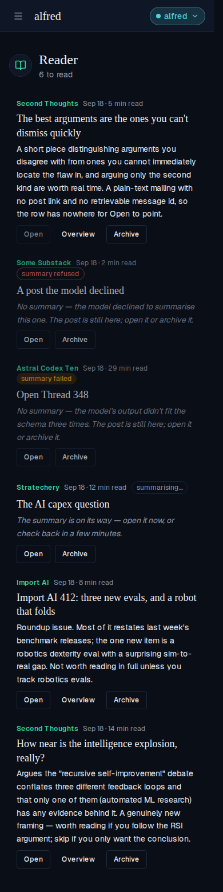

And one row expanded, all four overview sections stacked in the desktop order:

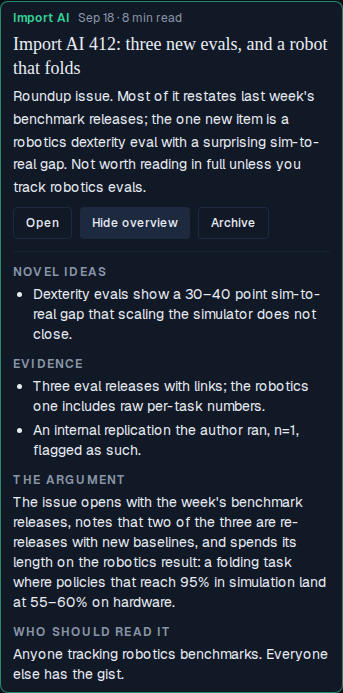

## 7 · The empty state

With nothing to read the heading says so rather than counting zero, and the shared `EmptyState` atom carries the resting message:

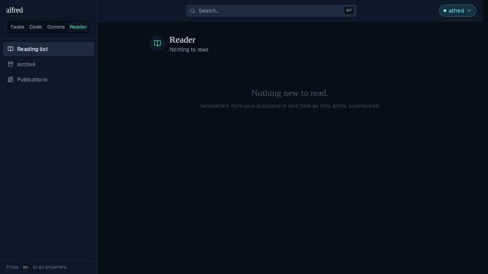

## 8 · The Comms shelf gives the Reader away

The one Comms surface this story changes (D14). Six inbound messages are seeded: one ASAP, one Today, one ordinary FYI receipt, and three newsletters the Reader has claimed. The shelf counts `1 message` — the claimed three are gone from it — and says where they went, with a live link to `/reader`.

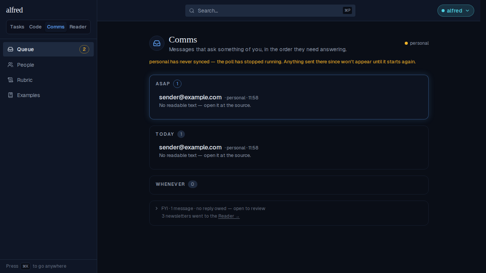

## 9 · The shell: a fourth module

The sidebar widens to 256 px and the switcher's type drops to 13 px (B16) so four labels fit with none truncated. Reader is the active segment, in the module green, over its own three-link nav with the count badge on the reading list:

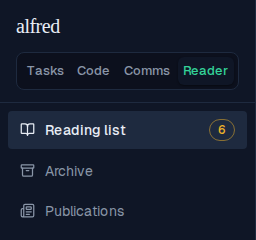

The same chrome inside the phone's hamburger drawer — the module is reached by touch exactly as the other three are:

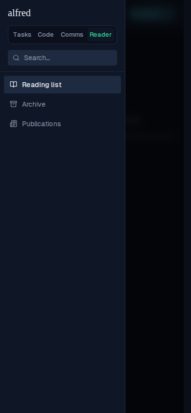

### The moved ViewSwitcher baselines

Re-framing the switcher moves three committed visual snapshots, so the evidence is the snapshot gate's own diff images — reference on the left, the new render on the right, the changed pixels in the middle. Each shows the same thing: the three existing segments squeezing left to make room for Reader at the smaller type. The new baselines on this branch are that regenerated output, approved with `npm run test:storybook:update -w frontend` and committed verbatim — none was hand-edited.

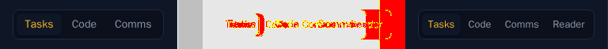

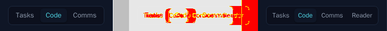

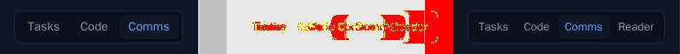

The gate is green against the re-approved baselines: 182 snapshots pass, including the eight new reader ones and the fourth switcher story.
