# Reader: Send to Instapaper replaces Open

*2026-09-25T21:13:44.921Z*

The Reader row's primary verb is now **Send to Instapaper**. One press saves the post to the owner's Instapaper (through a server-side route signing Instapaper's Full API with OAuth 1.0a) and archives it. The request carries the post's own email HTML, so a paid post arrives whole rather than as the paywall's teaser. The original stays one quiet **Original ↗** link away. Every shot below is the real app, driven through the Playwright harness against the in-memory Supabase mock, which also stands in for Instapaper's `bookmarks/add`.

**1 · The reading list.** A done row leads with Send to Instapaper (keycap `i` on the selected row). A failed row has no overview panel, so Original ↗ ends its verb row. The placeholder copy now says *send it or archive it*.

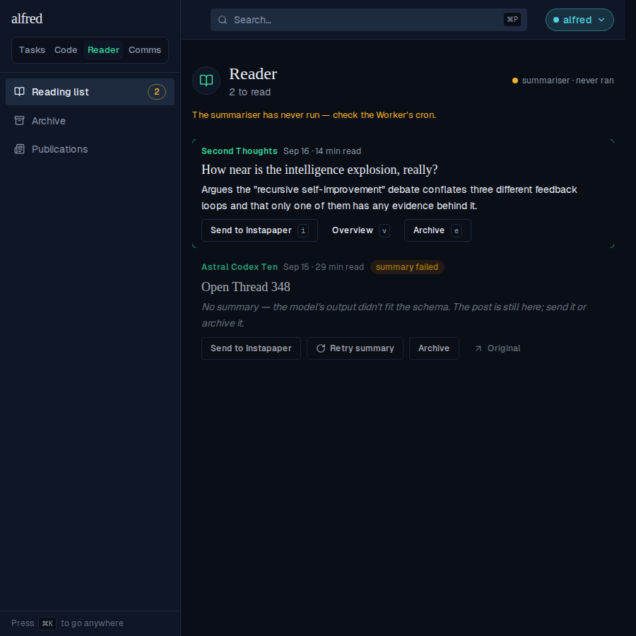

**2 · The overview open.** On a row that has a panel, Original ↗ (keycap `o`) joins the panel's footer beside Re-summarise. `o` opens it even while the panel is shut.

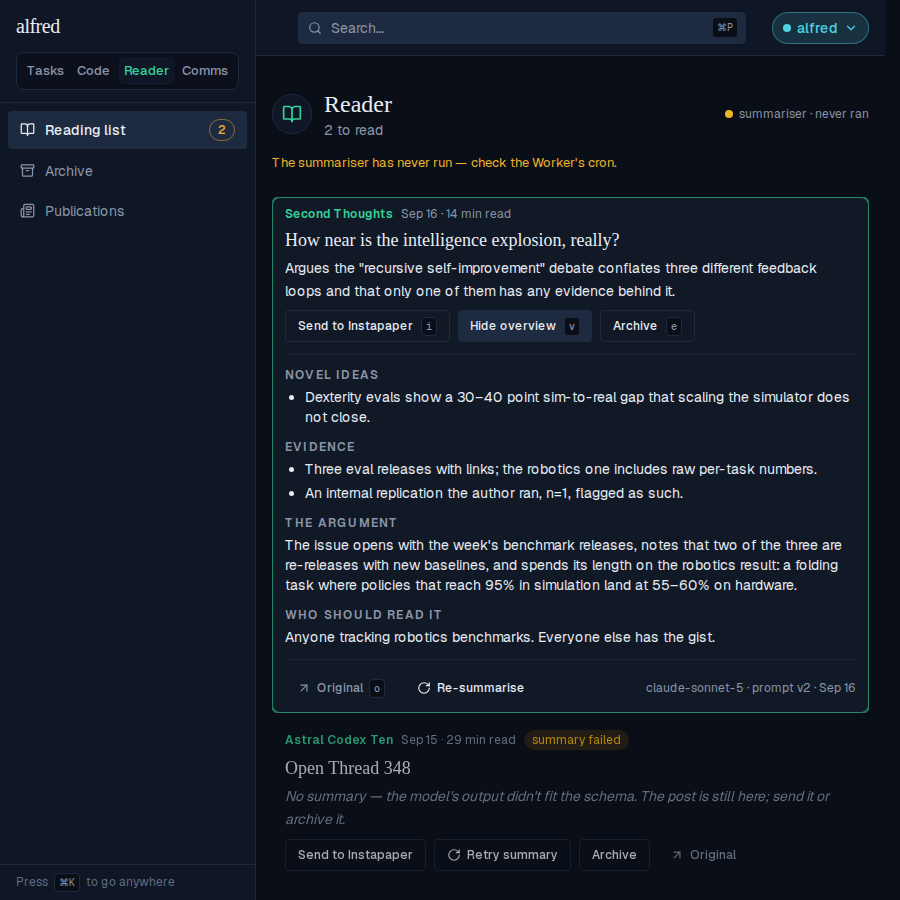

**3 · After Send.** The row played Archive's exit collapse and left the list (2 → 1 to read).

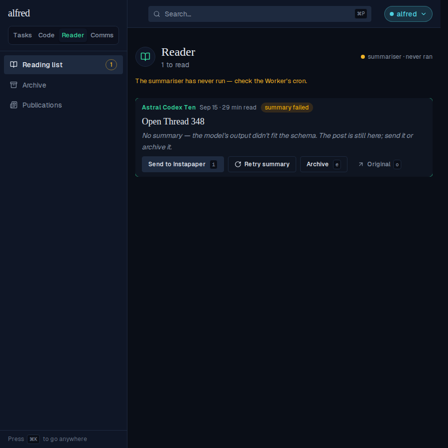

**4 · What Instapaper received.** The one request the mock recorded for that send, saved beside this doc by the capture run. It is signed (OAuth 1.0a HMAC-SHA1; the nonce, timestamp and signature vary per request, so they are elided). It uses the post's web link as `url` and the gist as `description`, and it carries the stored email HTML as `content`. There are no tags and no folder.

```bash
cat docs/demos/reader-send-to-instapaper/recorded-request.json
```

```output
{
  "authorization": "OAuth oauth_consumer_key=\"mock-consumer-key\", oauth_nonce=\"…\", oauth_signature=\"…\", oauth_signature_method=\"HMAC-SHA1\", oauth_timestamp=\"…\", oauth_token=\"mock-access-token\", oauth_version=\"1.0\"",
  "form": {
    "url": "https://secondthoughts.substack.com/p/how-near",
    "title": "How near is the intelligence explosion, really?",
    "description": "Argues the \"recursive self-improvement\" debate conflates three different feedback loops and that only one of them has any evidence behind it.",
    "content": "<html><body><h1>How near</h1><p>The whole paid post, as mailed.</p></body></html>"
  }
}
```

**5 · The archive.** The sent post is archived and wears the **in Instapaper** badge. Send stays live there; sending from the archive badges the row in place instead of moving it.

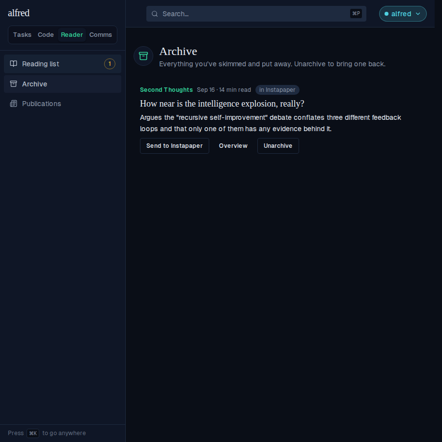

**6 · A refused send.** With the stand-in answering Instapaper's error 1221, the row comes back and the toast gives the route's reason. Nothing was written to the row.

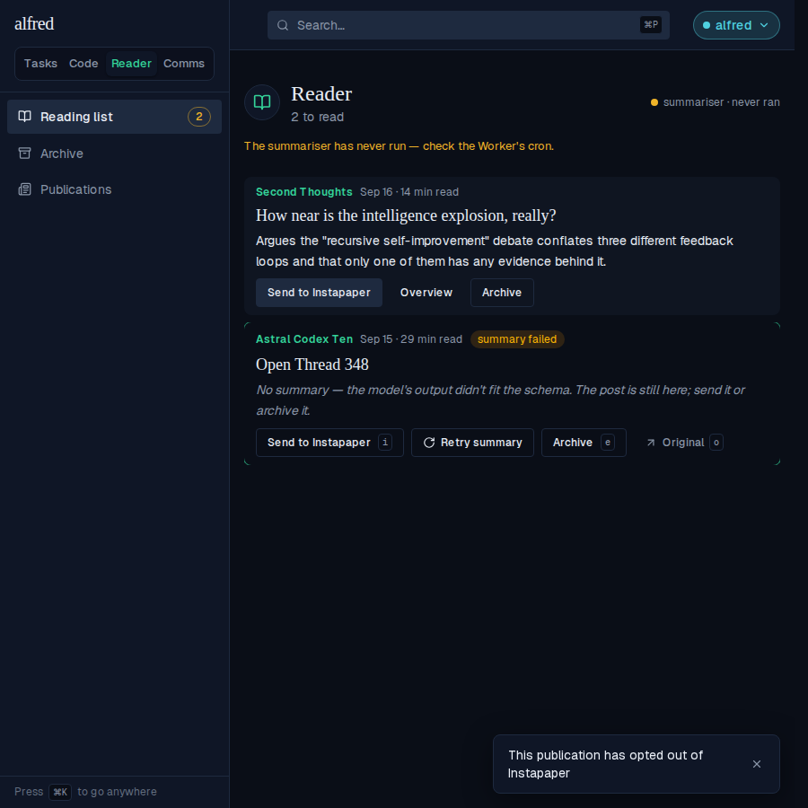

**7 · A 375 px phone.** Below `md` the verb row tightens its gap and padding, so Send to Instapaper · Overview · Archive fit on one line. The row gets 302 px, and the verbs needed 310 px at desktop spacing.

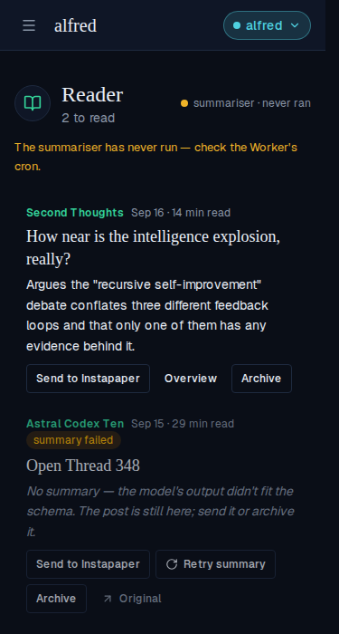

**8 · Send disabled, and why (Storybook, new baselines).** On a post with no web link and no stored text, Send is disabled with the title *No link and no stored text to send.* The second baseline is a deployment with no Instapaper credentials (the Work instance, local dev): Send is disabled with the title *Instapaper isn't set up on this deployment.*, and it has no `i` keycap even on the selected row.

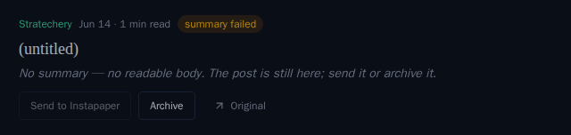

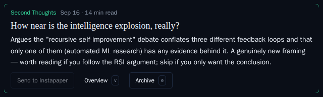

**9 · Moved Storybook baselines.** Each panel reads baseline | changed pixels | new render, as the snapshot gate wrote it before the baselines were approved. In every one, Open becomes Send to Instapaper; Original ↗ ends a panel-less row or joins the panel footer; and the placeholder says *send it*.

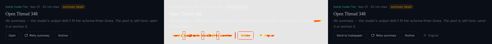

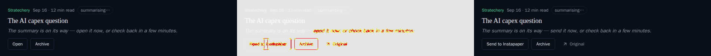

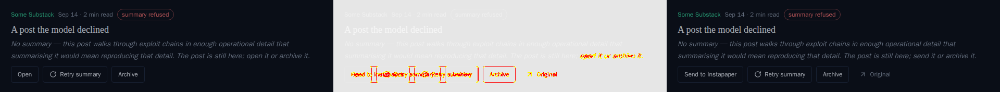

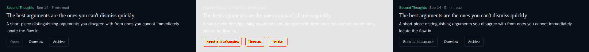

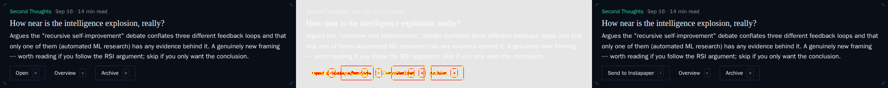

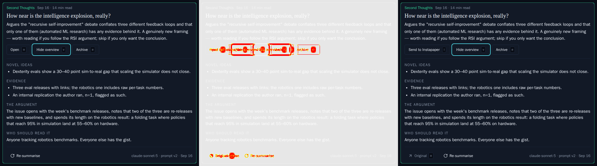

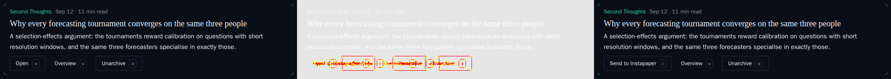

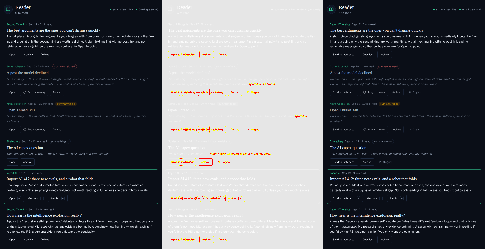

**10 · Alongside the wiki send (after bringing in ALF-261).** Main gained the Novel-ideas → wiki checklist while this branch was open. Its five `Wiki…` row stories were baselined with Open, so they are regenerated here with Send to Instapaper leading the verb row. The drift was under the snapshot gate's 1% threshold, so there is no diff image; this is the new baseline for the two-ticked state, with both sends on one row and Original ↗ in the footer.

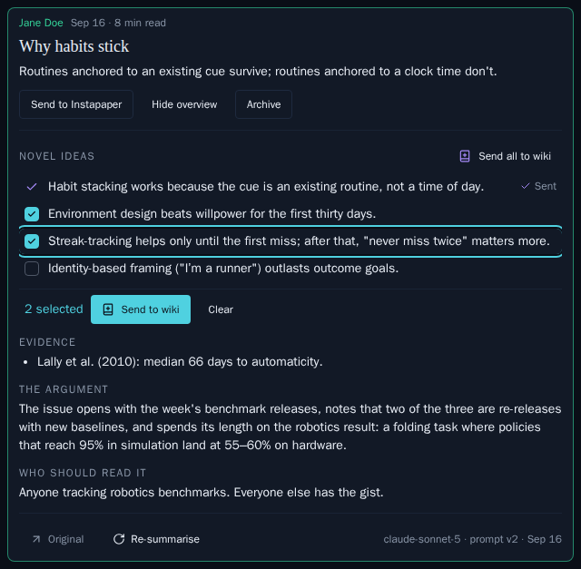

**After deploy (owner).** A real send can only be proved against Instapaper itself. Send one free post, one paid post and one link-less post, then check in Instapaper that the paid post arrived complete (not the teaser) and the link-less one arrived as a private article. Also check whether the email chrome (READ IN APP, the footer) crowds the article.
