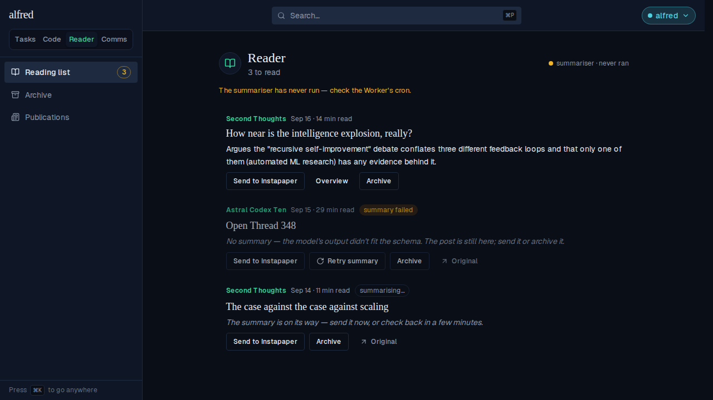
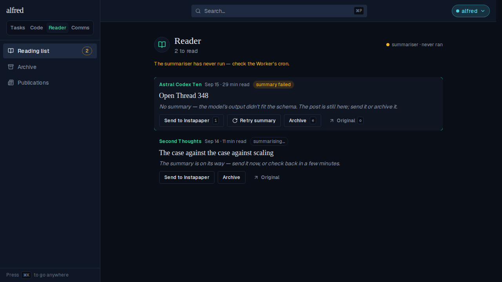
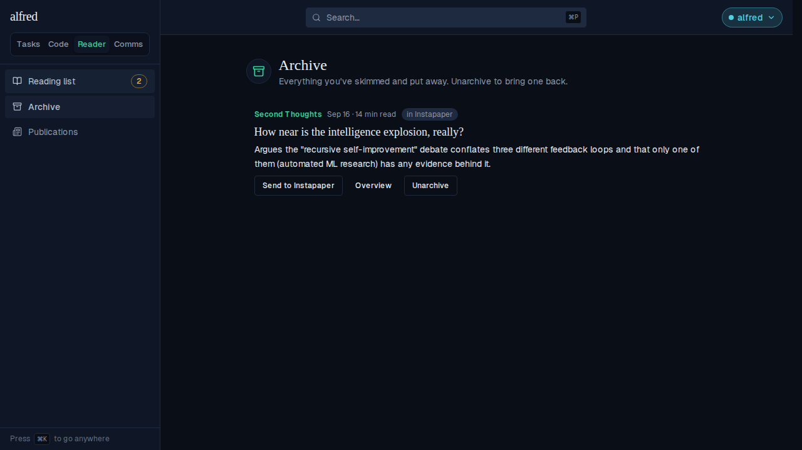
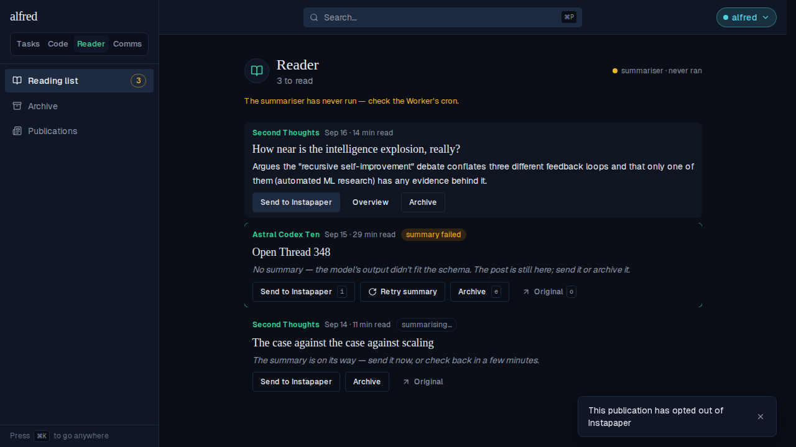
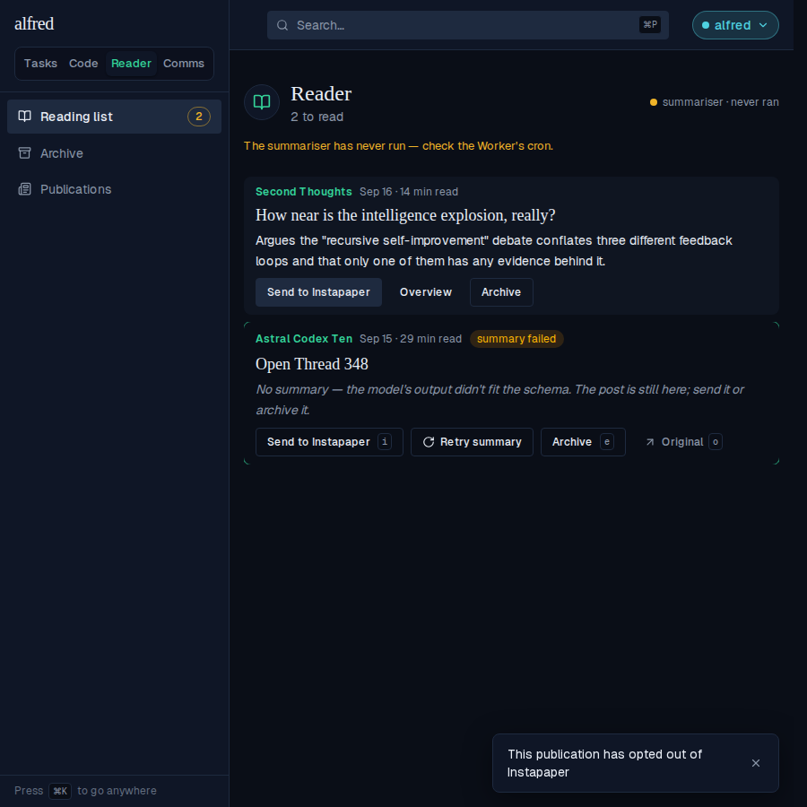
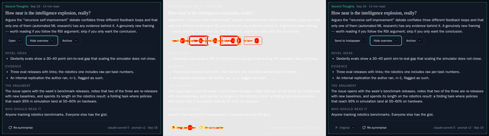
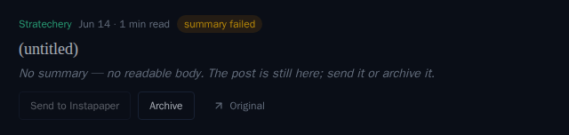
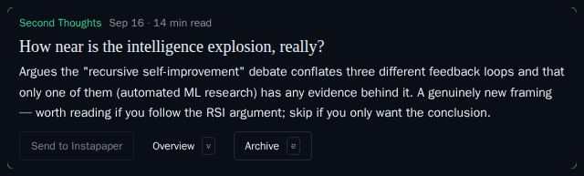
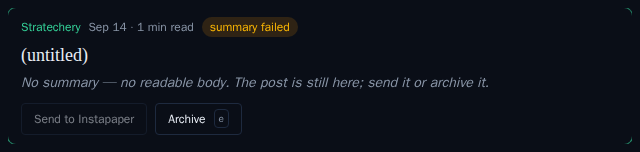

# Reader: Send to Instapaper replaces Open

*2026-10-04T16:42:57.532Z*

The reading list's primary verb is no longer "Open". One press of **Send to Instapaper** saves the post to the owner's Instapaper account and archives it here, because once a post is in Instapaper that is where it lives. The original stays reachable through a quiet `Original ↗` link.

Everything below is the real app driven through Playwright against the in-memory mock backend — which now stands in for Instapaper as well, because the send route calls it from the Next server where `page.route()` cannot reach.

## The journey

The reading list, with three posts in three different states. Every row leads with the new verb; the two rows with no overview panel carry `Original ↗` at the end of the verb row instead, and the placeholder copy now says "send it" rather than "open it".



Pressing Send on the top row: it plays the archive's exit collapse and leaves the list, and the count drops to 2.



It is in the archive, carrying its `in Instapaper` badge — and `Unarchive` where `Archive` was. Sending again from here would not move the row; the badge is already on it.



## When Instapaper refuses

With the mock seeded to answer error 1221 ("this publication has opted out"), the optimistic row comes back where it was and the toast says the route's own sentence — not a generic "try again", which for this refusal would be a lie. Nothing is written to the row.



## What the route actually sent

The request the mock recorded for the send above, captured from its `/__mock__/state` endpoint. The two per-request OAuth values and the signature are replaced so the capture reproduces; everything else is verbatim.

The point of the whole feature is the `content` parameter: the post's own email HTML travels with the request, so Instapaper parses the article it is handed instead of fetching the URL — which is how a paid post the owner subscribes to arrives in full rather than as the paywall's teaser.

```bash
cat docs/demos/reader-send-to-instapaper/instapaper-request.txt
```

```output
requests recorded: 1

POST /api/1/bookmarks/add
Authorization: OAuth oauth_consumer_key="mock-consumer-key",
       oauth_nonce="<per-request>",
       oauth_signature_method="HMAC-SHA1",
       oauth_timestamp="<per-request>",
       oauth_token="mock-access-token",
       oauth_version="1.0",
       oauth_signature="<HMAC-SHA1 over the base string>"
Content-Type: application/x-www-form-urlencoded; charset=utf-8

url = https://secondthoughts.substack.com/p/how-near-is-the-intelligence-explosion
title = How near is the intelligence explosion, really?
description = Argues the "recursive self-improvement" debate conflates three different feedback loops and that only one of them (automated ML research) has any evidence behind it.
content = <html><body><h1>How near is the intelligence explosion, really?</h1><p>Argues the debate conflates three different feedback loops.</p></body></html>
```

## The committed visual baselines that moved

Fifteen Storybook snapshots moved and four are new. The snapshot gate's own 3-panel diffs (baseline | changed pixels | received) are below for the states the spec draws; the regenerated baselines are committed with this doc.

The done row, selected: `Open o` becomes `Send to Instapaper i`, and nothing else on the row changes.



The same row with its overview open — `Original ↗` joins the panel footer beside `Re-summarise`, and the stamp stays right.



A failed row has no panel, so `Original ↗` ends the verb row instead — every row with a link keeps exactly one way out.



And a pending row, where the placeholder copy changes with the verb.



## The two states where the verb cannot work

Both render disabled with a `title` saying which reason applies, so a press that would fail says so before it is pressed. These are new baselines rather than diffs.

A post with no http(s) link and no stored text left — there is no article and nowhere for Instapaper to find one, and the route refuses the same case with a 409.



And a deployment with no Instapaper credentials — local dev and the Work instance. Every row says so whatever its own state, and `Original ↗` still works.


## After deploy, for the owner

Nothing above proves a real Instapaper save: every byte of this ran against the mock. Once the four `INSTAPAPER_*` vars are set on the Personal instance's Vercel project (Production) and it has redeployed, send three posts and check Instapaper:

1. A **free** post — it should arrive complete.
2. A **paid** post you subscribe to — it should arrive complete rather than as the web paywall's teaser. That is what carrying the email HTML buys.
3. A **link-less** post — it should arrive as a private article rather than not at all.

Also worth a look while you are there: whether the mail chrome ("READ IN APP", the unsubscribe footer) crowds the article in Instapaper's reader. Nothing here depends on the answer; if it does crowd, a follow-up can send only the post's body container.
