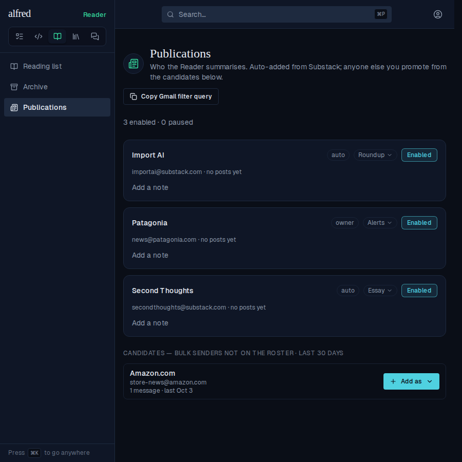
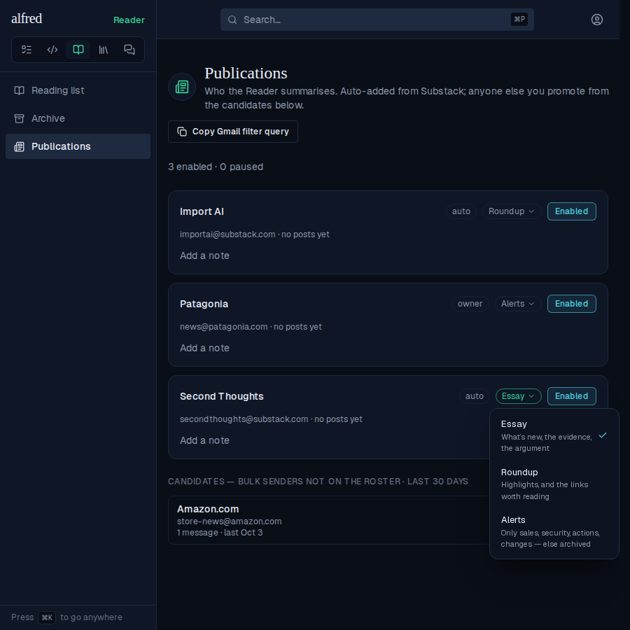
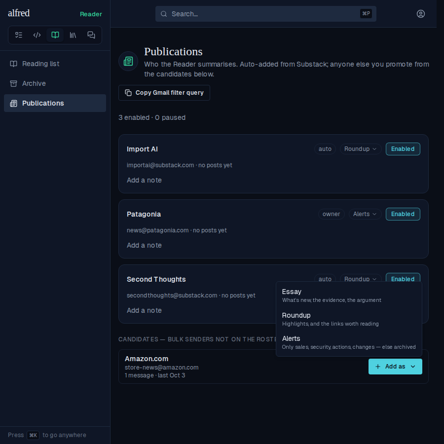
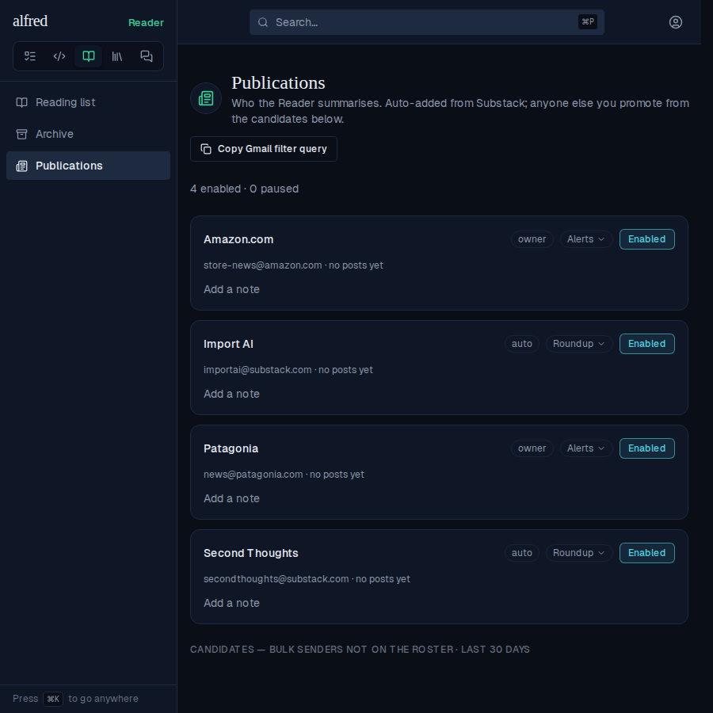
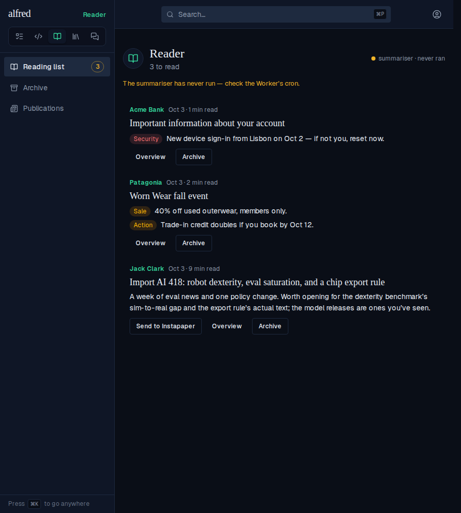
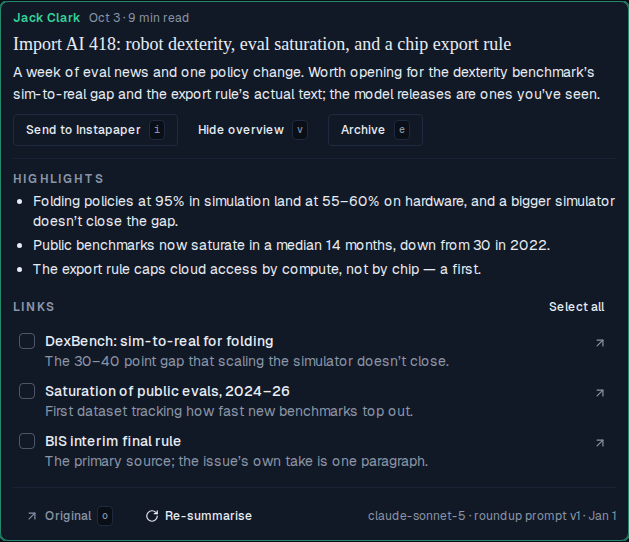
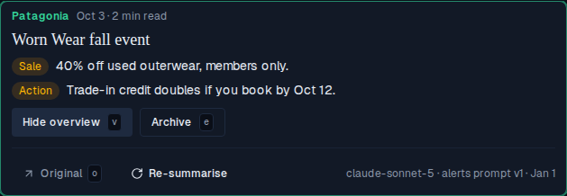
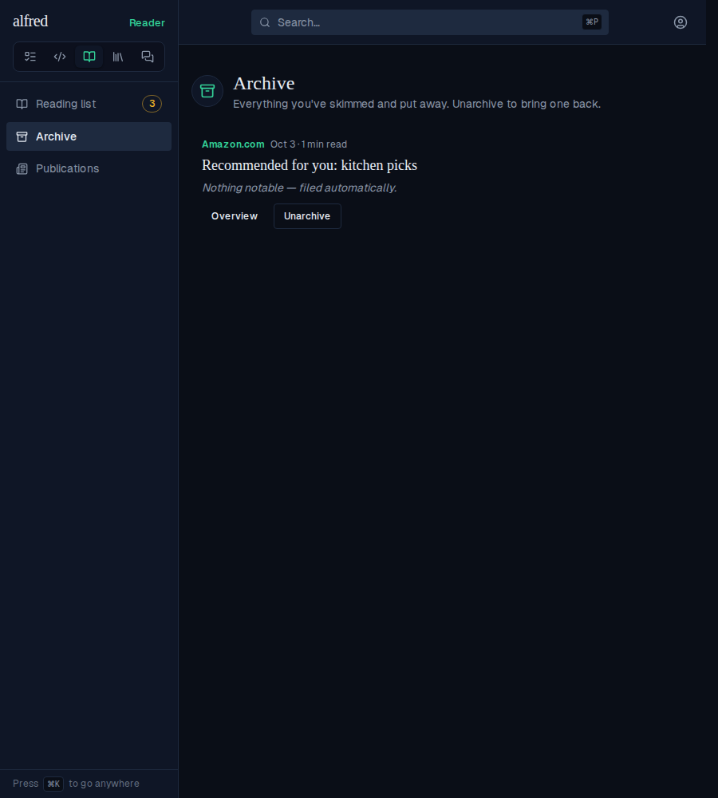
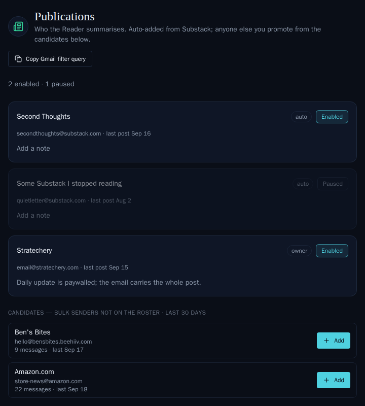
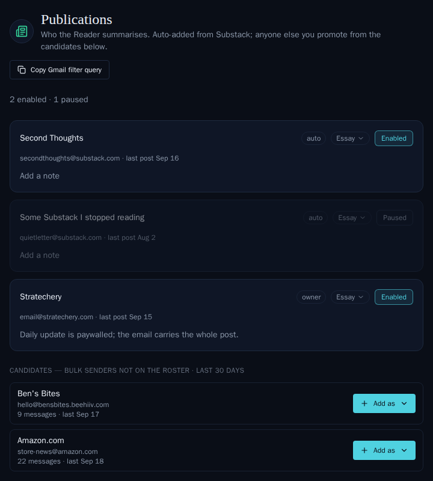

# Reader summary kinds: Essay, Roundup and Alerts

*2026-10-03T19:05:00.429Z*

Each Reader publication now has a summary kind, and the summariser asks each kind a different question: **Essay** (the default — today's prompt, unchanged and still stamped prompt v2), **Roundup** (what's striking in the issue itself, plus the linked pieces worth reading in full) and **Alerts** (only sales, security events, required actions and changes; a post with none is filed to the archive by the tick). Posts render by the kind they were summarised under, so changing a publication's kind rewrites nothing; Retry summary uses the current kind.

## The prompt changes per kind

The eval script's dry run prints what `buildReaderRequest`, the same call the summariser makes, builds for a post: the kind's system prompt (first sentence), the overview its schema asks for, and the numbered links the model may pick from. Here is the link-roundup fixture asked as each kind. Essay is today's request; Roundup asks for highlights and links from the same numbered list; Alerts asks for findings only and sends **no** links block, since a promo mail's links are tracking noise.

```bash
npm run --silent eval:reader -w workers -- --fixtures --dry-run --kind essay | awk '/^link-roundup$/,0' | grep -E '^link-roundup|^  (prompt|overview|links)'
```

```output
link-roundup
  prompt         You summarise newsletter posts for one person who subscribes to far more of them than they can read.
  overview       novel_ideas, evidence, argument, who_should_read, further_reading
  links          8
```

```bash
npm run --silent eval:reader -w workers -- --fixtures --dry-run --kind roundup | awk '/^link-roundup$/,0' | grep -E '^link-roundup|^  (prompt|overview|links)'
```

```output
link-roundup
  prompt         You summarise link roundups — newsletter issues that are mostly a curated set of links with short commentary — for one person who subscribes to far more newsletters than they can read.
  overview       highlights, links
  links          8
```

```bash
npm run --silent eval:reader -w workers -- --fixtures --dry-run --kind alerts | awk '/^link-roundup$/,0' | grep -E '^link-roundup|^  (prompt|overview|links)'
```

```output
link-roundup
  prompt         You read corporate, retail and account email — promotions, store newsletters, account and service notices — for one person who only wants to know whether a message requires or rewards their attention
  overview       findings
  links          none
```

## Choosing a kind on /reader/publications

Every publication card carries a kind chip between its provenance badge and its pause toggle. Existing publications read Essay. This is the live app against the mock backend, with one card of each kind and an off-roster bulk sender as a candidate.



Opening a card's chip lists the three kinds, each with the question it asks; the open chip turns green.



Picking Roundup saves at once: the picker closes and the chip updates before the PATCH settles (it rolls back with a toast if the PATCH fails).


A candidate's Add is now **Add as ▾**, so a promo sender can't be claimed as an essay on the next tick.



Added as Alerts: the candidate leaves the list and its card reads Alerts.



## The reading list by kind

Rows render by the kind they were **summarised under** (`reader_posts.summary_kind`), not by the publication's current kind. These posts are seeded as the tick writes them. An Alerts row shows its findings in place of the gist, one tagged line each (Security in the destructive tone, the rest amber), and has no Send. A Roundup row looks like an Essay row until it's opened.



A Roundup's overview shows Highlights, then **Links**. Links is the existing Further reading checklist under a new heading, with the same Reader/Instapaper sends and sent marks. The stamp names the kind's prompt: `roundup prompt v1`.



An Alerts row's Overview holds only the footer: Original, Re-summarise and the stamp.



An Alerts post with no findings is shown here as the tick leaves it: archived, reading 'Nothing notable — filed automatically.' The tick's own writes have no visual surface, and the mock backend can't run the Worker, so they are pinned by tests rather than shown: the kind and per-kind version stamped on the done patch, `archived_at` set in that same write, and Retry re-summarising under the publication's current kind (`workers/src/reader/scheduled.test.ts`, *summary kinds*).



## Moved snapshot baselines

The three existing publications stories moved by less than the 1% threshold, so the gate couldn't emit a diff. Populated is shown before and after; the two empty-state stories change the same way. Every other existing baseline, including every Essay row, was left untouched. Before:



After: the kind chip on each card, and **Add as ▾** on candidates.


