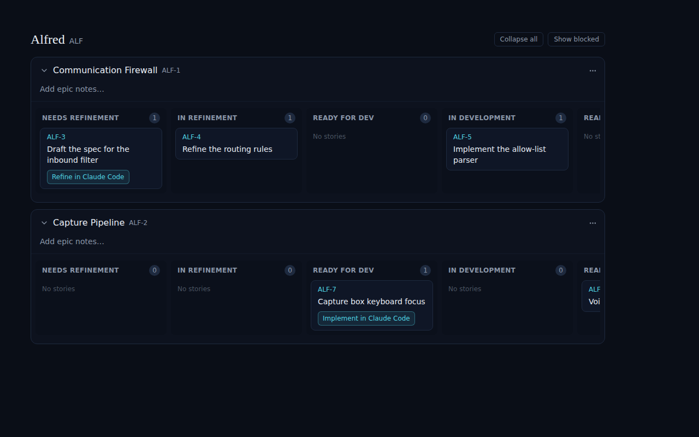
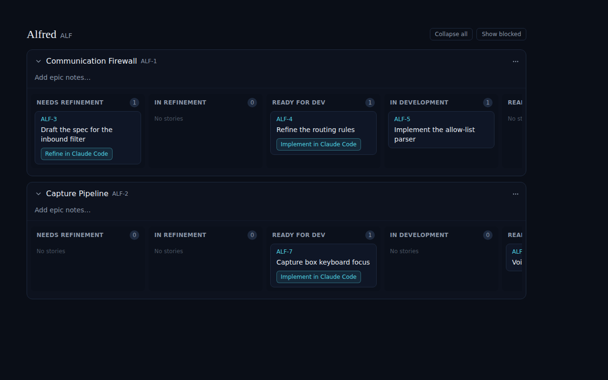

# Story swimlanes update live (ALF-41)

*2026-06-17T21:36:19.906Z*

A story's swimlane is its `factory_state` on the `code_items` sidecar. That state is written **out of band** by the webhook Worker (refinement PR merges → `ready_for_dev`, implementation PR opens → `ready_for_review`, etc.). The Code board is seeded once at the layout and is otherwise authoritative for the session, so before this change a Worker-driven transition never reached the open tab — the card sat in the wrong lane until a hard reload. This change subscribes the open board to Supabase Realtime on `code_items` and applies each UPDATE through the store reducer so the card moves swimlanes live.

### 1. Enable Realtime on the table (migration 0003)

Realtime delivers nothing until the table joins the `supabase_realtime` publication. The RLS policy from 0002 still gates the stream, so the authenticated browser session receives changes with no new policy.

```bash
cat database/migrations/0003_realtime_code_items.sql
```

```output
-- Story swimlanes update live: stream code_items row changes to the open Code board.
-- factory_state is written out-of-band by the webhook Worker, so the browser needs a
-- push channel to reflect PR-driven transitions without a reload.
--
-- Realtime delivers nothing until a table joins the supabase_realtime publication. RLS
-- still governs the stream: code_items already has the `authenticated full access` policy
-- (using (true)) from 0002, so an authenticated browser (anon key + session) receives
-- changes; no new policy and no database.types.ts regeneration are required.
alter publication supabase_realtime add table code_items;
```

### 2. The card moves swimlanes live

Below: the Code board with **ALF-4 "Refine the routing rules" in the _In Refinement_ lane** — the state the user left it in by launching a refinement session.



The refinement PR merges; the **Worker writes `factory_state = ready_for_dev`** on the `code_items` row. A Realtime UPDATE arrives on the already-open board and the reducer's `patchStory` re-groups the card — no reload, no navigation. The same board now shows **ALF-4 in _Ready for Dev_** (its _In Refinement_ lane is empty), with the "Implement in Claude Code" launch now offered:



### 3. Notifications on a live transition

When a Realtime UPDATE **changes `factory_state`**, the handler also fires a toast (`"<ref> moved to <label>"`, e.g. `ALF-4 moved to Ready for Dev`) via the shared toast queue, and — when the tab is backgrounded — prefixes the browser tab title (`● ALF-4 → Ready for Dev`, or a rolling `(N) updates · …` count), restoring the original title on the next focus. Non-state updates (e.g. a spec-markdown write) and echoes of the user's own optimistic write fire neither: the previous state is read before dispatch, so a self-write where `previous === next` is silent.

### Reproducing the live end-to-end move (local, credentialed)

The swimlane move, toast, tab title, unknown-id no-op, and idempotent echo are all covered deterministically by unit + RTL tests against a mocked channel (`frontend/lib/stores/code-store.test.tsx`). A true end-to-end check needs a live Supabase project (so `0003` is published and a websocket connects) plus a second writer, which a CI/web sandbox lacks. To verify locally: apply `0003` with `supabase db push`, open the board, then drive a second writer — `PATCH /api/code/:ref` with a new `factory_state`, or a signed sample `pull_request` payload to the Worker — and watch the card move with no refresh.
