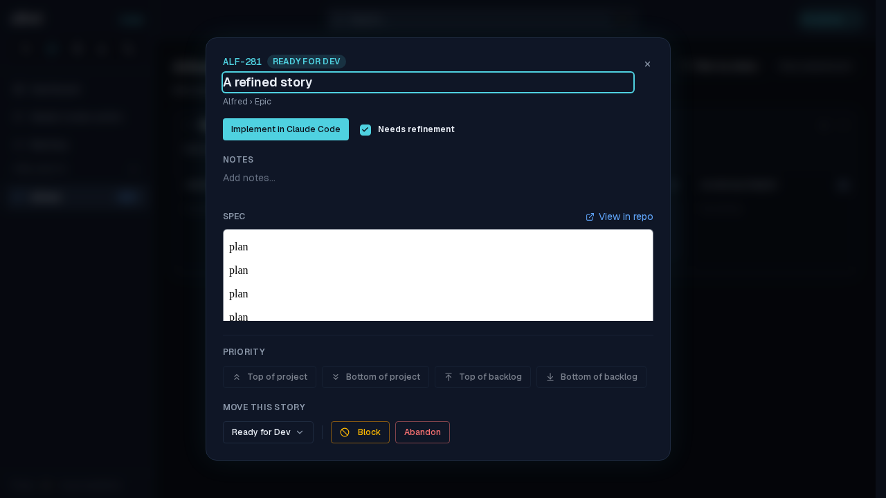
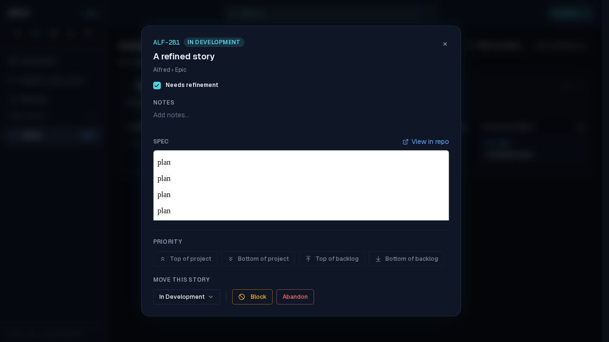

# Launching a refined story no longer crashes the board on return

*2026-09-28T15:35:31.771Z*

ALF-277. Launching a refined story (one with a snapshotted spec) from its detail modal wrote the new state, and Supabase Realtime echoed that UPDATE back. Postgres leaves an UPDATE's unchanged TOASTed columns — values over ~2 KB, which any real spec is — out of the replication message, so the echo arrived WITHOUT a spec_markdown key. The code store copied that absence onto the story as undefined, the open modal's spec view called .trim() on it, and Next's root error boundary replaced the page: "This page couldn't load". It surfaced on returning to Alfred because the echo lands while the Claude tab is in front.

The journey below runs the production build against the mock backend with the realtime stub, delivering the echo exactly as Supabase does (spec_markdown omitted). Step 1 — the refined story's modal, opened from a ?story= deep link, spec rendered:

Step 2, before the fix — click Implement in Claude Code; the launch's own echo arrives without spec_markdown and the page dies with "Cannot read properties of undefined (reading 'trim')":

Step 2, after the fix — the same launch and the same echo. The realtime handlers now apply only the columns the payload delivered (deliveredColumns), so the story moves to In Development and keeps its spec. The epic handler, which copied spec_markdown the same way, gets the same treatment.

