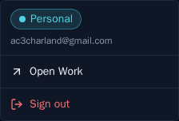
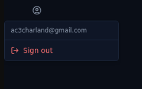

# ALF-206: Remove the work account

*2026-09-28T12:38:56.573Z*

The Work deployment is going away (work now firewalls Vercel), so alfred is a single deployment again. The top-right Personal/Work switcher pill goes with it. It becomes a neutral icon **Account menu** that shows the signed-in email and Sign out. Sign out stays one deliberate click behind the trigger. The four `NEXT_PUBLIC_*INSTANCE*` env vars and `lib/instance.ts` are deleted. The migrate and backup workflows stop fanning out to a `work` database.

Nothing in the code, workflows, live docs or skills still reads the instance vars or the Work database secret, or describes the two-instance setup in the present tense. The historical demos, archived specs, spikes and applied migrations are left as they were:

```bash
git grep -nE 'NEXT_PUBLIC_(OTHER_)?INSTANCE|SUPABASE_DB_URL_WORK|getInstanceConfig|InstanceMenu|instance-isolation|the Work instance|Personal and Work|(two|both) alfred instances|both instances' -- frontend workers database .github docs .claude ':!docs/demos' ':!docs/specs/archive' ':!docs/spikes' ':!database/migrations' || echo 'no references'
```

```output
no references
```

Migrate and backup each run one job now, against the Personal database only:

```bash
grep -nE 'matrix|INSTANCE:|SUPABASE_DB_URL:' .github/workflows/migrate.yml .github/workflows/backup.yml
```

```output
.github/workflows/migrate.yml:44:          INSTANCE: personal
.github/workflows/migrate.yml:49:          SUPABASE_DB_URL: ${{ secrets.SUPABASE_DB_URL_PERSONAL }}
.github/workflows/backup.yml:55:          INSTANCE: personal
.github/workflows/backup.yml:59:          SUPABASE_DB_URL: ${{ secrets.SUPABASE_DB_URL_PERSONAL }}
```

**Before:** the instance pill (Personal, teal) with its Open Work link (from the ALF-64b demo).



**After:** a neutral icon trigger opening just the signed-in email and Sign out (Storybook `Shell/AccountMenu › SignedIn`).


