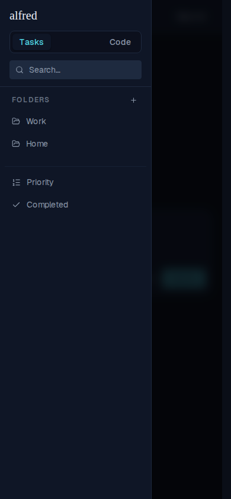

# Mobile drawer no longer auto-focuses the search field

*2026-07-03T00:30:36.710Z*

ALF-90: on mobile, opening the hamburger nav drawer auto-focused the search field — Radix Dialog moves focus to the first focusable child on open, and the search input's onFocus opens the results dropdown. The result: every time you opened the sidebar, the keyboard popped and the search dropdown covered the folder list.

**Before** — opening the drawer focuses the search field (bright focus ring) and its results dropdown opens over the folders:

**After** — the drawer opens with focus left on the trigger: the search field is unfocused (no ring, no dropdown) and the folder list is fully visible. Focus only moves to search when the user taps it.

