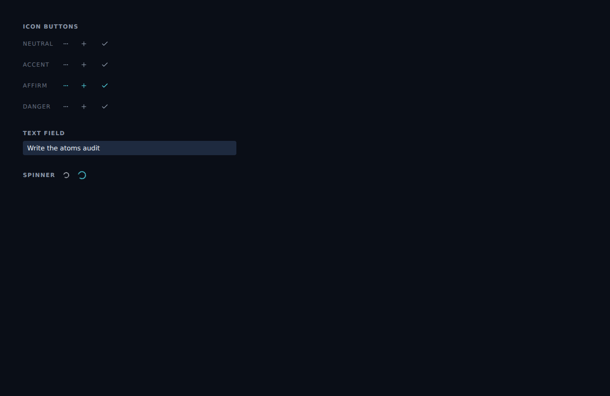

# Shared UI atoms: IconButton, TextField, Spinner, FieldLabel

*2026-06-10T21:53:33.567Z*

The frontend's repeated UI primitives — square ghost icon buttons, inline text inputs, the saving spinner, and the uppercase field-label eyebrow — were copy-pasted across task rows, the folder nav, the capture box, and the mobile nav. They are now four reusable atoms in `frontend/components/atoms/`, each with unit tests and Storybook stories, and the consumers compose them instead of repeating raw markup.

The component library at a glance — `IconButton` (four tones × three sizes; affirm is teal), `TextField`, `Spinner`, and `FieldLabel`, rendered together from the `Atoms/Gallery` Storybook story on the app's dark theme:



Each atom ships as a triad — component, co-located unit test, and Storybook story:

```bash
ls -1 frontend/components/atoms/ | sort
```

```output
atoms-gallery.stories.tsx
field-label.stories.tsx
field-label.test.tsx
field-label.tsx
hello.test.tsx
hello.tsx
icon-button.stories.tsx
icon-button.test.tsx
icon-button.tsx
spinner.stories.tsx
spinner.test.tsx
spinner.tsx
text-field.stories.tsx
text-field.test.tsx
text-field.tsx
```

Consumers refactored to compose the atoms instead of repeating markup: `task-row` (expand toggle, add-subtask, more-actions buttons + the Due date / Notes labels), `folder-nav` (create / save / rename / delete buttons + the create & rename inputs), `capture-box` (compact input + both saving spinners), and `mobile-nav` (hamburger trigger). All 214 frontend unit tests stay green, including the 24 new atom tests written red-first.
