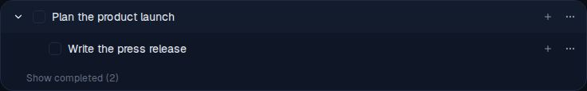
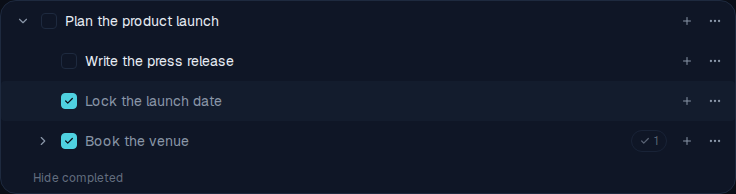
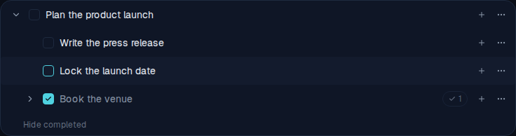

# Show completed subtasks under a parent

*2026-06-12T18:59:51.536Z*

Completed subtasks no longer vanish from the active views. Under each parent, completed children are tucked behind a **"Show completed (N)"** toggle (N = the count of *direct* completed children), and the parent carries a second badge counting **all** completed descendants. Unchecking a completed child pops it back to active; if that child's parent was itself completed, the parent reactivates too (a completed parent can't keep an active child).

**1. Collapsed parent — two badges.** `Plan the product launch` has one active subtask and three completed descendants (`Lock the launch date`, `Book the venue`, and its child `Confirm catering`). The grey `1` badge is the existing active-children count; the new `✓ 3` badge to its right counts every completed descendant.

**2. Expanded — the active child plus a "Show completed (2)" link.** Expanding the parent shows its active subtask and, at the bottom of the list, a "Show completed (2)" link. The `(2)` counts only the *direct* completed children (the deeper `Confirm catering` is not counted here).

**3. Revealed — completed children + a "Hide completed" link.** Clicking the link unhides the completed children with the same expand animation as opening a parent. They render low-contrast with their checkbox checked, and the link becomes "Hide completed" at the bottom of the new list. `Book the venue` keeps its own `✓ 1` badge for its completed descendant.

**4. Unchecking pops a child back to active.** Unchecking `Lock the launch date` instantly moves it (no animation) up into the active list at full contrast, offering "complete" again. `Book the venue` stays completed below. The active/completed counts and the "Show completed" label update automatically.

