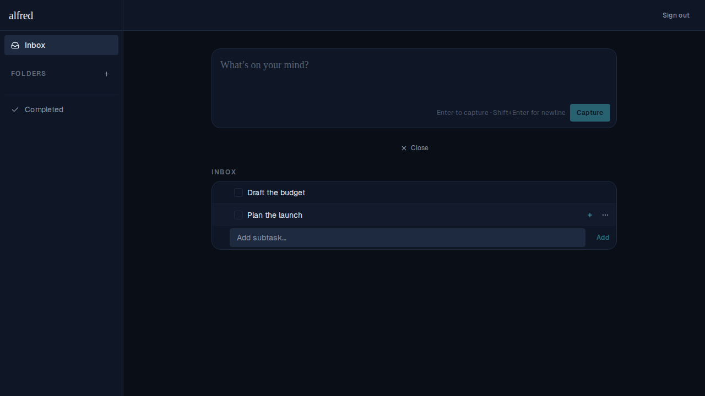
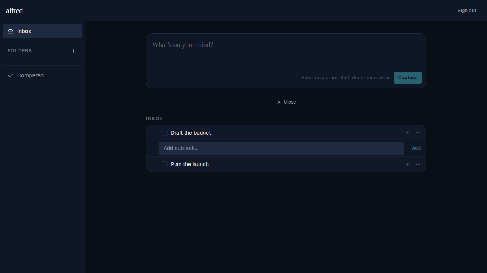
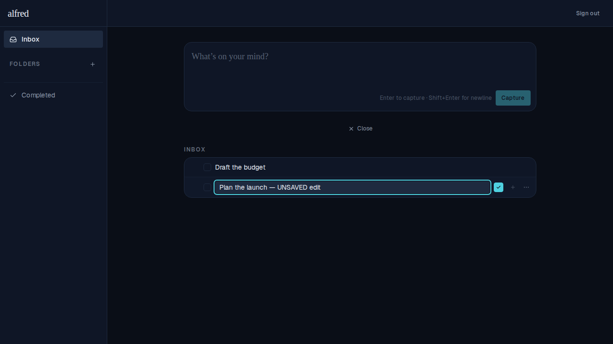
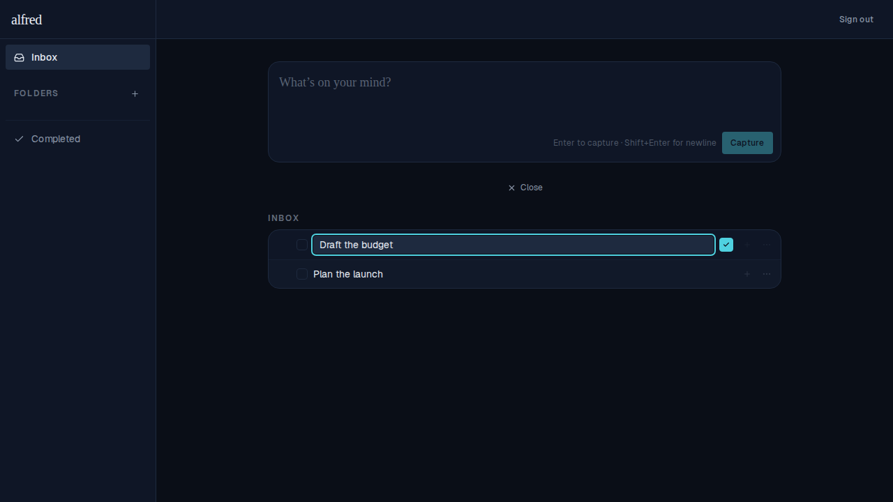

# Only one inline input open at a time

*2026-06-12T18:54:16.159Z*

Across the task rows, only ONE inline input may be open at a time: the title-edit text box on an item and the add-subtask entry box on a parent are mutually exclusive. Opening one closes whatever was open before. The Inbox hero capture box ("What's on your mind?") is the single exception — it is always available.

## The subtask entry box is exclusive across rows

Open the add-subtask box on "Plan the launch":

Now open it on "Draft the budget" — the first box closes automatically, so only one is ever open:

## An in-progress title edit is abandoned without saving

Double-click "Plan the launch" to edit its title and type an unsaved change:

Double-click "Draft the budget" to edit it instead — the first edit is abandoned (its title reverts to "Plan the launch", the unsaved change is discarded) and the second item's edit box activates:

