# Story detail on a phone: a full-screen sheet above the keyboard

*2026-09-30T05:06:49.404Z*

On a phone, a story now opens as a full-screen sheet sized to the part of the screen above the keyboard. What you read scrolls; every action sits in a pinned bottom bar; the notes editor grows to fit its text instead of shrinking to two rows. The desktop card is untouched: every desktop `code-storydetailmodal--*` baseline passes unchanged.

Part 1 is the committed Storybook snapshots at 390 wide, each shown as **baseline (before) | changed pixels | received (after)**. The baselines were first captured against the pre-change code.

**Ready for dev.** The centred card becomes a sheet. Title and breadcrumb scroll with the body; the note sits in a tinted well with a pencil; the spec is a document row that opens full-screen instead of a 28rem frame; the two priority rows and the "Move this story" row collapse into the pinned bar (Implement, status, Priority, ⋯).

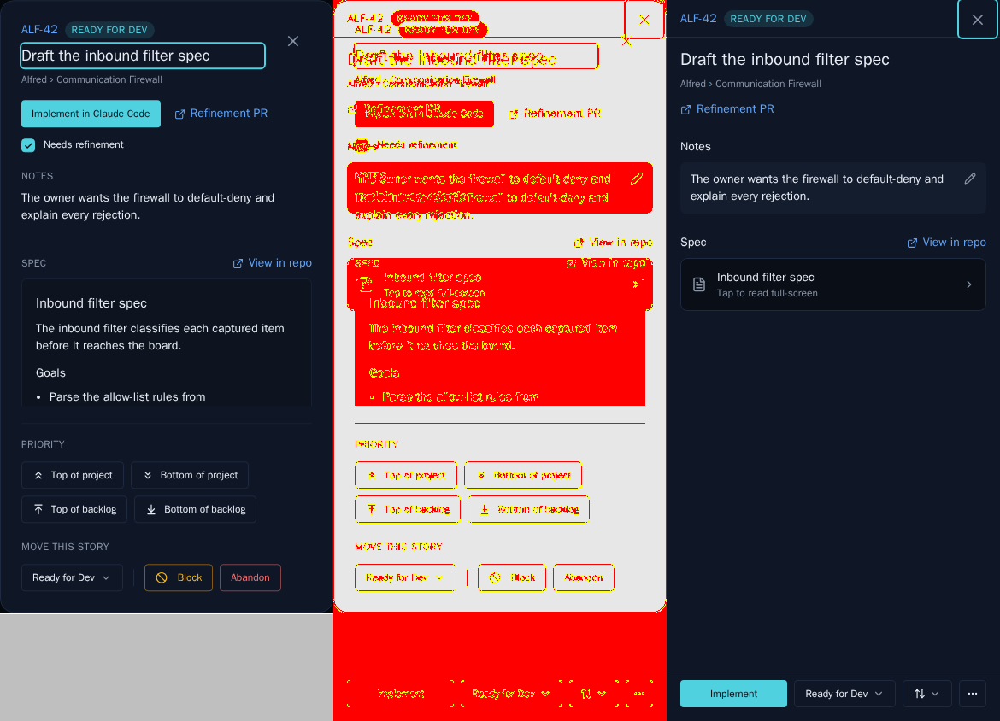

**Needs refinement.** The launch reads "Refine" (short label); "Skip to Development" and the "Needs refinement" mark moved into ⋯.

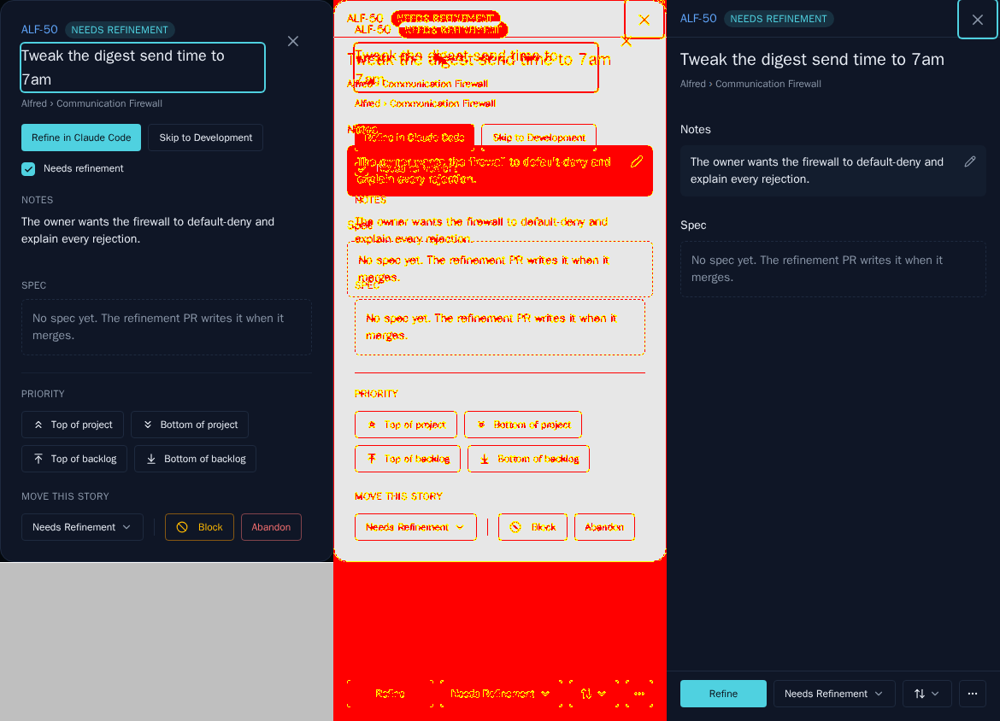

**Blocked.** No launch phase, so the bar holds status, Priority and ⋯ left-aligned; Unblock and Abandon are in ⋯.

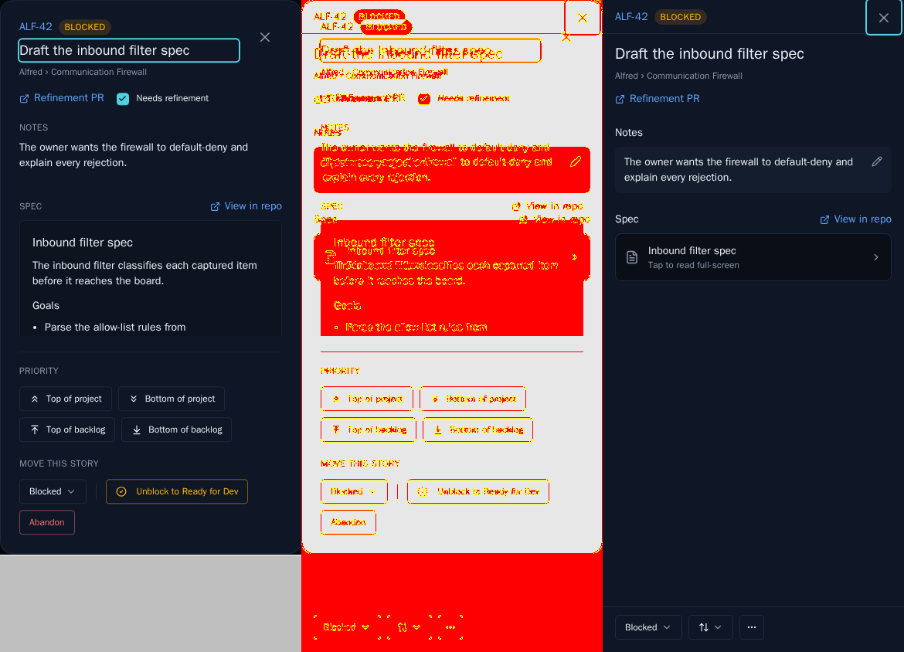

**Editing a long note.** Before: a two-row box scrolled to its last line, the rest unreadable. After: the editor grows to show the whole note with no inner scroll, and Save/Cancel sit in their own bar below it.

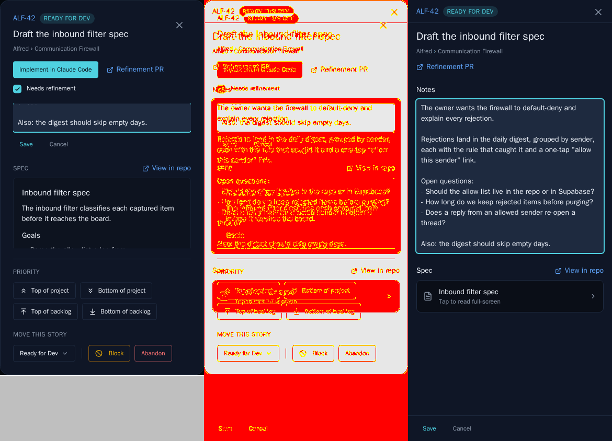

**Keyboard up** (a 390x470 viewport stands in for a raised keyboard). Before: the notes area is squeezed to nothing behind fixed sections. After: the sheet is exactly the visible height, scrolled to the end, with the last line above the Save/Cancel bar.

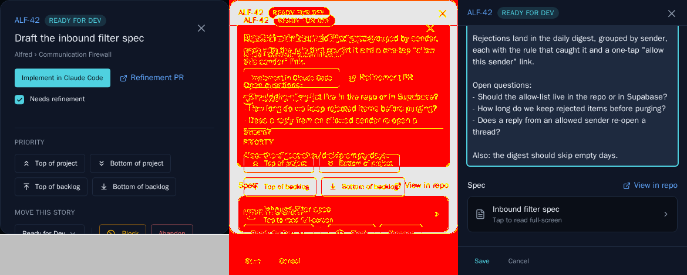

**Block reason.** The reason editor is an amber card at the end of the body that grows with its text; Cancel and Confirm block are in the footer instead of under a clipped box.

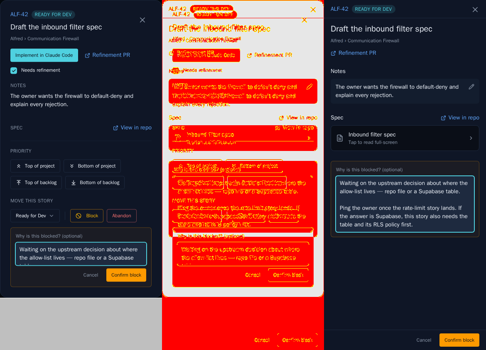

Part 2 is the live app (the Playwright mock backend), driven at 390x844 with touch. The keyboard stand-in in the last step shrinks the viewport to 470px mid-edit, exactly as `window.visualViewport` shrinks when iOS raises its keyboard.

1. The sheet at rest.

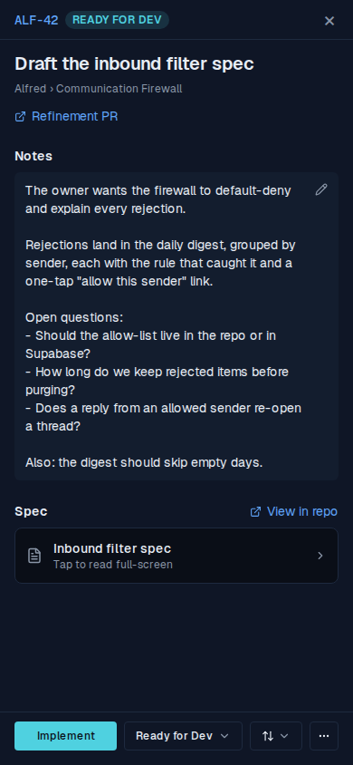

2. Priority is one menu with the four jumps and their disabled states.

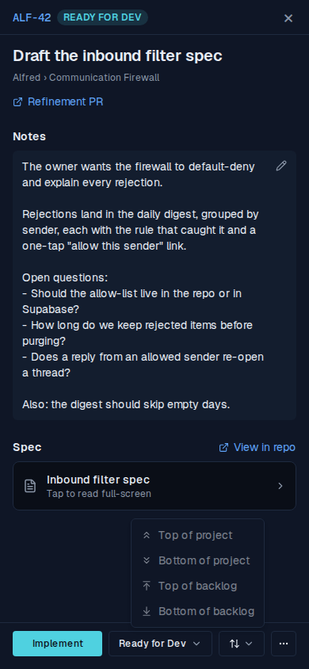

3. ⋯ holds the rarer actions: a checked "Needs refinement" item, then Block… and Abandon (Skip to dev too, on a needs-refinement story).

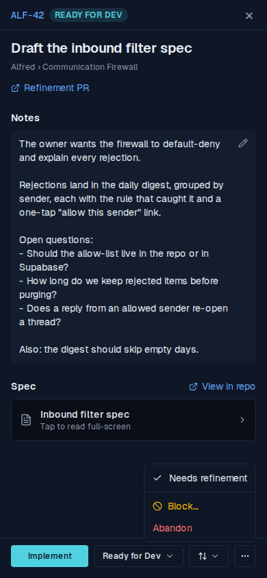

4. Tapping the spec row opens the spec full-screen over the sheet.

5. Editing the note with the keyboard down: Save/Cancel replace the action bar in the footer.

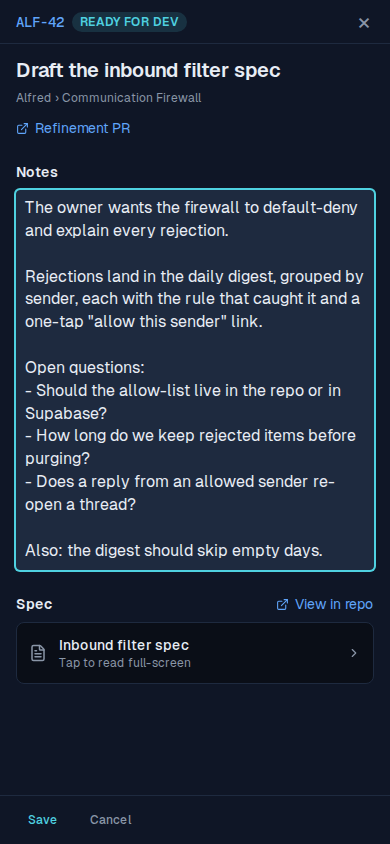

6. The same edit with the keyboard up (470px): the sheet follows the visible viewport, the header stays, and scrolled to the end the editor sits above the Save/Cancel bar.

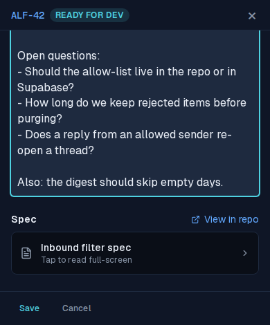
