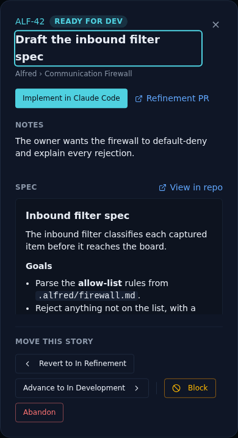
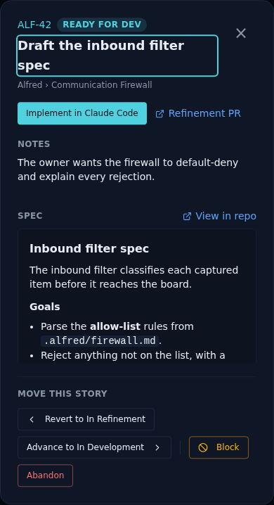
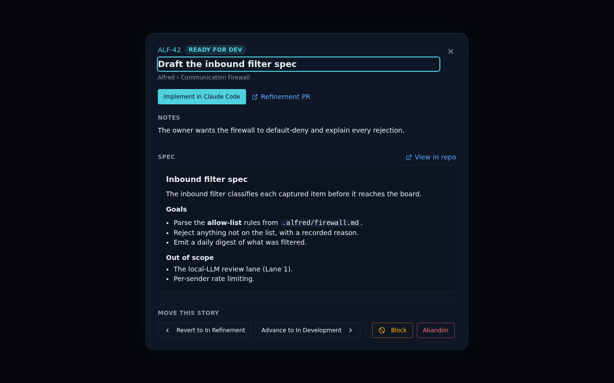

# ALF-138: make the story modal's close button a real tap target on mobile

*2026-07-26T03:51:05.907Z*

The story detail modal's close button (the × in the top-right corner) used a fixed 24×24px hit area (p-1 around an 18px glyph) at every viewport. On a phone that's well under the ~44px minimum recommended touch target, making it easy to miss-tap. The fix enlarges it to a 44×44px box below Tailwind's md breakpoint (matching the backlog reorder-chevron convention already used elsewhere in the code board), and keeps today's compact 24×24px hit area at md+ and up.

Before — the StoryDetailModal's MobileReadyForDev Storybook story (390×844, the phone viewport used by the modal's existing mobile snapshot) with the original 24px close button:

After — the same story with the fix applied: the close button now fills a real 44×44px tap target on mobile:

Desktop (md+) is untouched — the same ReadyForDev story at the default 1280×800 viewport still shows the original compact 24px close button:

