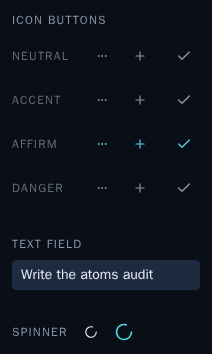
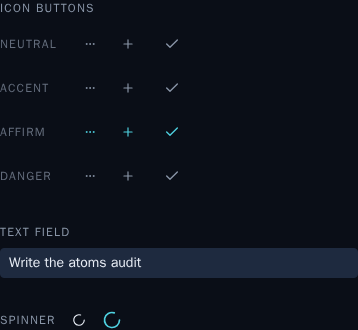
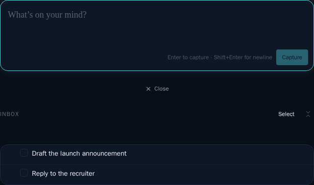
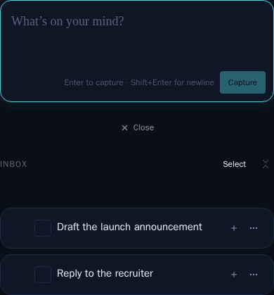
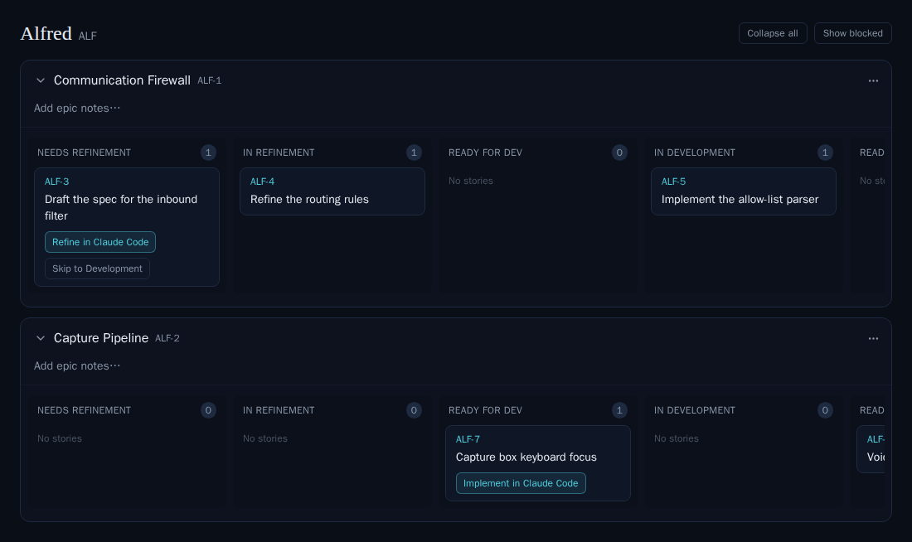
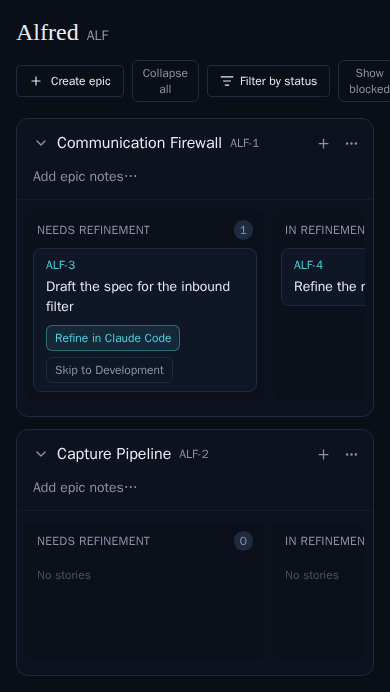
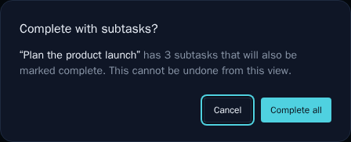
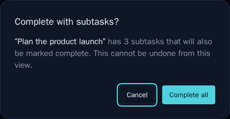
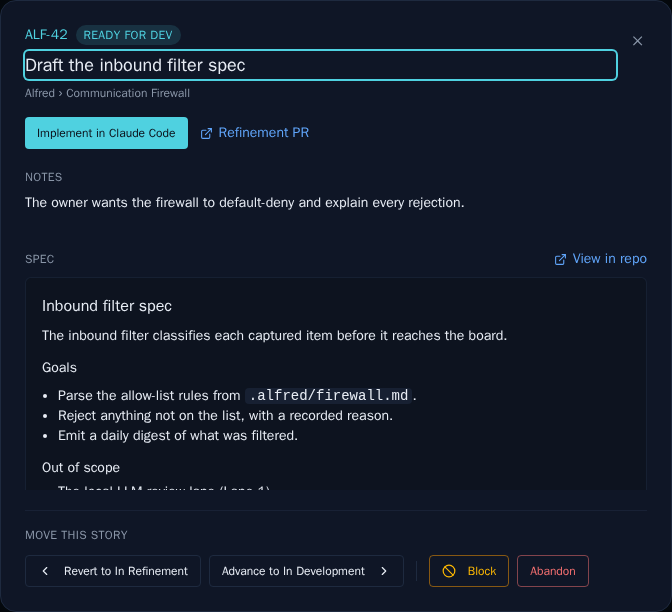
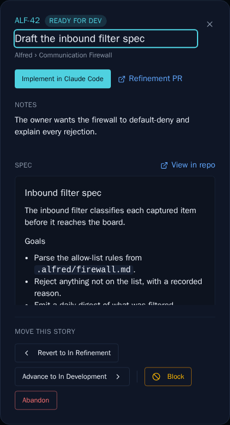

# Mobile & desktop Storybook snapshot audit (ALF-87)

*2026-07-03T00:15:49.841Z*

ALF-87 extends the committed Storybook image-snapshot set so every audited surface is captured at **both** a desktop viewport and a phone viewport (390×844). ALF-86 already added the task-row mobile cards and the code-backlog mobile rows; this adds the atoms library, the tasks inbox screen, the code board, and the two confirmation/detail modals. The pairs below are the committed baselines — open this doc to audit how each surface looks on mobile vs desktop.

## Atoms library — the shared UI primitives

Desktop: the library shrink-wrapped to its content. Atoms have no `md:`-gated behaviour, so a tight crop is viewport-independent — the mobile audit instead renders them at a realistic phone column width, where the shared text field stretches edge-to-edge as it does in the capture box.

## Tasks — inbox screen (capture box + inbox list)

The main tasks screen had no visual coverage; both viewports are now captured. On mobile the task rows adopt their `md:`-gated card layout.

## Code — project board

Desktop `Seeded` (existing baseline) beside the new phone-width board: at 390px the toolbar and swimlanes scroll horizontally rather than wrapping — the real mobile behaviour, now locked in.

## Tasks — cascade (complete-with-subtasks) modal

A `w-full max-w-md` dialog: 448px centered on desktop, full-width edge-to-edge on a 390px phone. Previously unsnapshotted.

## Code — story detail modal

Desktop `ReadyForDev` (existing) beside the phone-width capture: the header actions, breadcrumb, notes, and rendered spec markdown reflow to a single narrow column.

