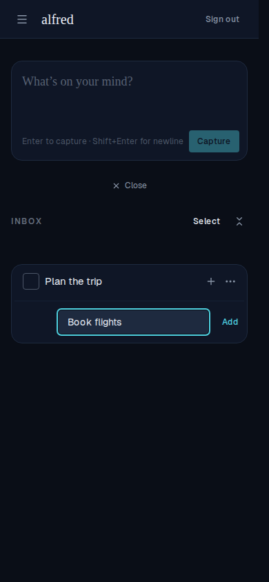

# ≥44px touch target for the inline add-subtask 'Add' button (mobile)

*2026-07-16T21:44:27.456Z*

ALF-98 — on mobile, adding a subtask often felt broken: you'd type a subtask, reach for the small 'Add' button, and a slightly-off tap would dismiss the field with nothing created. The compact 'Add' button was a `size="sm"` button — only **32px** tall, below the ~44px minimum comfortable touch target. A near-miss lands just outside its hit area, which blurs the input — and the compact capture box tears itself down on blur, so the half-typed subtask vanishes.

Fix: enlarge the button's **real box** to **44px** tall on mobile (`min-h-11`), back to the compact 32px at `md+` where pointer devices don't need it. It's a real-box change, not an invisible overlay: the button sits flush beside the `flex-1` text field, so an overlay would extend over the field and clip its focus ring. (Measured with a touch viewport: the 'Add' button reports `height=44` on mobile, `height=32` at md+.)

Below, on a 390×844 touch viewport: the inline add-subtask field with 'Book flights' typed and the taller 'Add' target beside it — the field's teal focus ring is intact (the enlargement doesn't disturb the layout).

Tapping 'Add' creates the subtask: 'Book flights' appears nested under 'Plan the trip' (0/1), and the field stays open for the next one.

