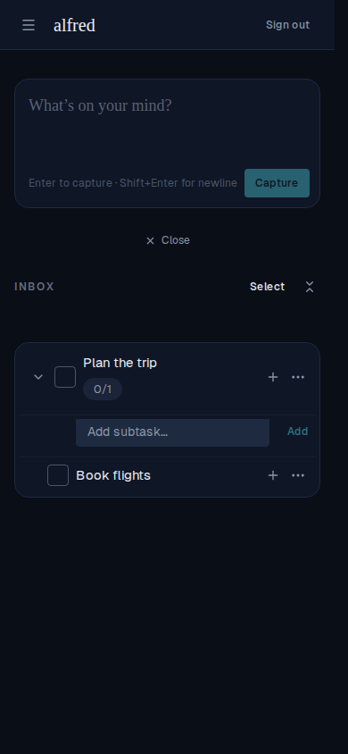

# Enlarged touch target for the inline add-subtask 'Add' button (mobile)

*2026-07-16T21:10:48.318Z*

ALF-98 — on mobile, adding a subtask often felt broken: you'd type a subtask, reach for the small 'Add' button, and a slightly-off tap would dismiss the field with nothing created. The compact 'Add' button was a `size="sm"` button (32px tall). A near-miss lands just outside its hit area, which blurs the input — and the compact capture box tears itself down on blur, so the half-typed subtask vanishes.

Fix: give the compact 'Add' button the project's `mobileTapClass` — an invisible ::after overlay that expands the touch target to ≥44px on mobile without changing the drawn button, removed at md+ where pointer devices don't need it (the same pattern the task-row checkbox and expand chevron already use). Extracted `mobileTapClass` to `lib/ui/mobile-tap-class.ts` so both call sites share one definition.

The demo drives a real 390×844 touch viewport. It types a subtask, then TAPS ~20px below the visible 'Add' button — a natural thumb near-miss that falls outside even the button's built-in touch slop. Same tap, same coordinate, with and without the fix:

**Before (small button):** the near-miss tap below 'Add' blurs the input, tearing the field down. The subtask is gone and 'Plan the trip' has no children — the bug users hit.

**After (enlarged ≥44px target):** the identical tap now lands on 'Add' and submits — 'Book flights' is created nested under 'Plan the trip' (0/1), and the field stays open for the next one.

