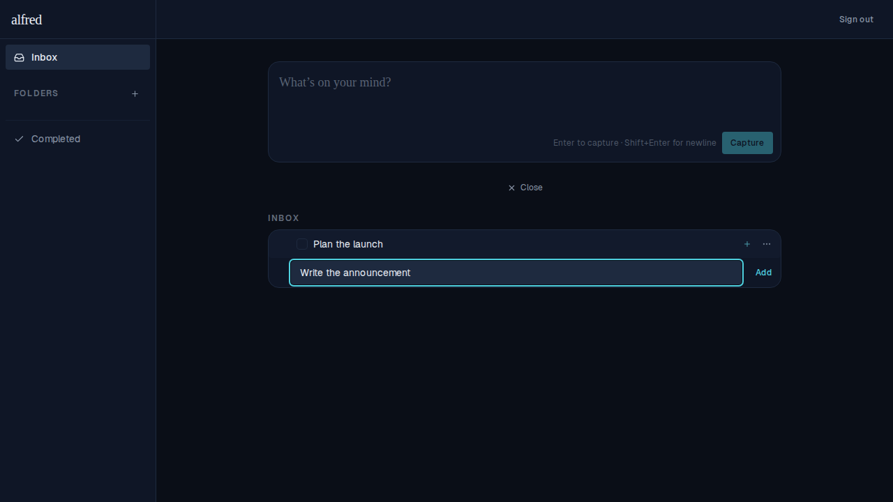
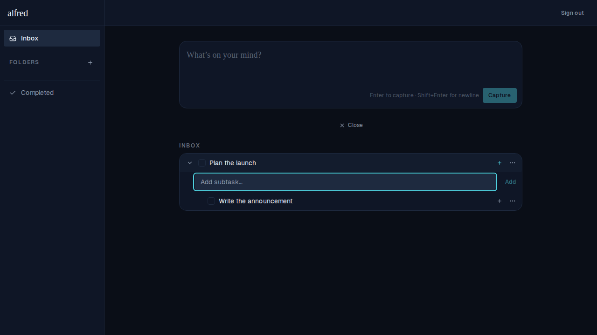

# Subtask input stays open after adding

*2026-06-12T17:16:09.429Z*

When adding subtasks, pressing Enter keeps the text box open so you can immediately type the next one — just like the main capture box. Press Escape to dismiss.

**Before:** "Write the announcement" typed and ready to submit.

**After:** Enter pressed — "Write the announcement" appears as a subtask, box clears and stays focused for the next entry.

