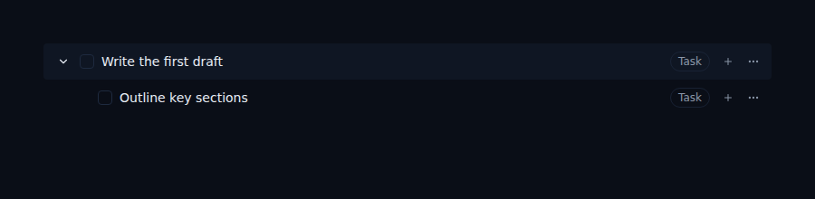

# Fix subtask creation for classified tasks (ALF-29)

*2026-06-17T21:19:45.604Z*

Adding a subtask under a classified task previously failed with a DB constraint violation: the store always created items as item_type='unclassified', but the items_task_only_fields constraint requires any row with a parent_id to have item_type='task'. This fix sets item_type='task' in both the store (addTask action) and the API route (POST /api/items) whenever a parent_id is present.

The store fix: when parentId is provided, the create input now uses item_type: 'task' instead of the unconditional 'unclassified'. The optimistic row also reflects this, so the UI never flickers an unclassified appearance before the server responds.

A task row with its subtask expanded and nested underneath, both displaying the 'Task' type badge — the state a newly created subtask reaches after the fix:

Top-level capture (the inbox capture box, no parentId) is unchanged: new items without a parent still default to item_type='unclassified' for the triage flow.
