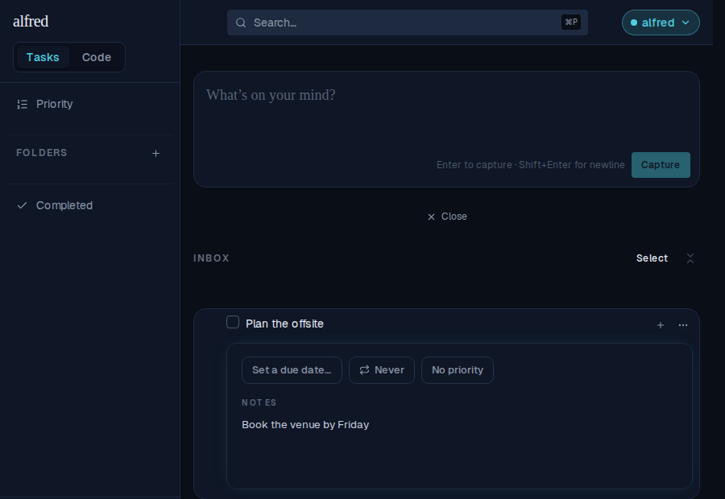
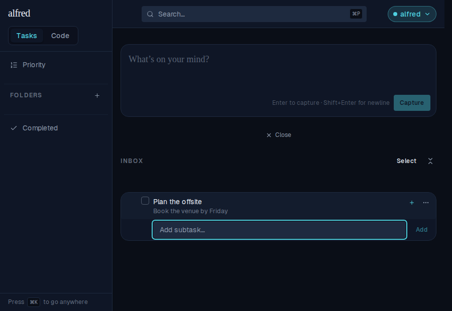
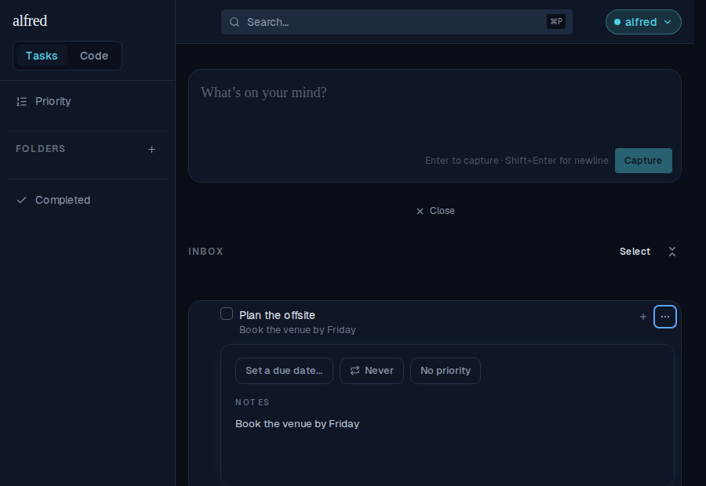
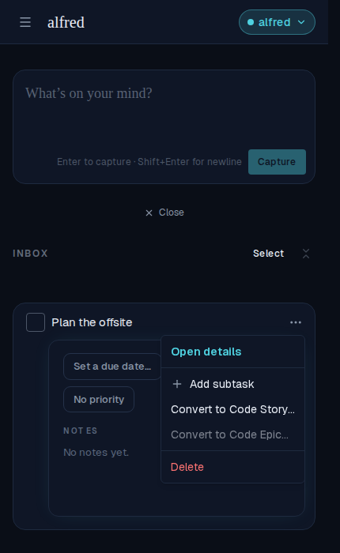
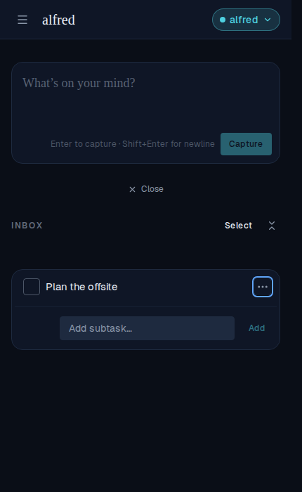
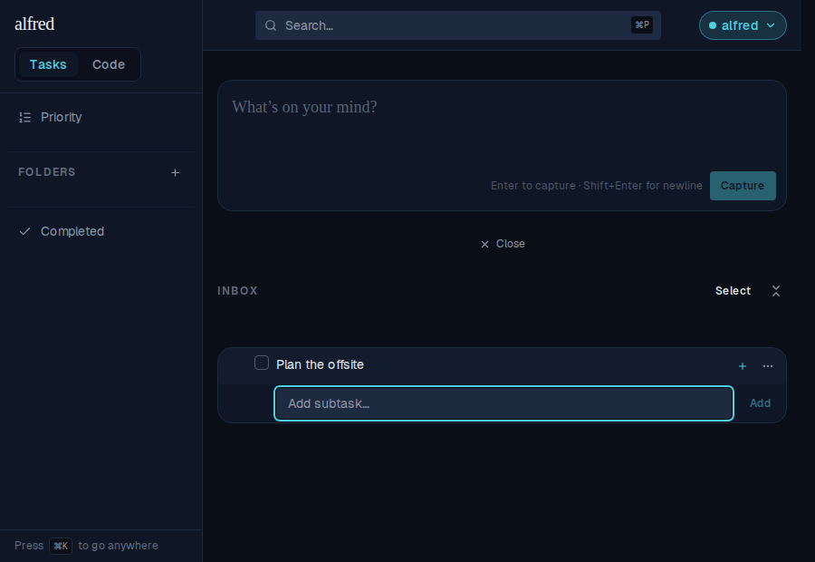
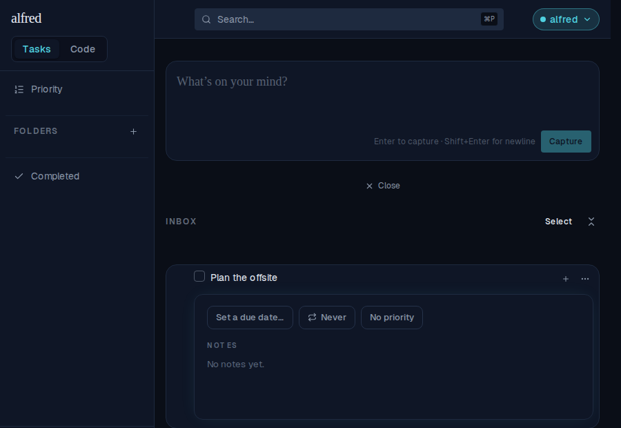

# Opening the subtask entry closes the task's detail panel

*2026-07-25T21:04:57.619Z*

The inline detail panel and the add-subtask entry field both render between a row's body and its subtask list. With both open the entry box sits buried under the panel, far from the row it belongs to. They are now mutually exclusive on a row: opening either closes the other.

## The "+" button

A task row with its detail panel open — notes typed but not yet blurred:

Pressing **+** opens the entry field and the panel closes with it. Nothing typed is lost — the panel commits its pending notes on the way out, and the saved text shows as the row's one-line preview:

Re-opening the details confirms the note was persisted, not dropped:

## The ⋯ menu's "Add subtask" (mobile)

On mobile the **+** collapses into the ⋯ menu. The menu is a portaled layer, so opening it over the panel is not an outside press — the panel is still there behind it:

Choosing **Add subtask** closes it just as the **+** does:

## The other direction

With the entry field open:

…opening the details leaves only the panel. This half needs no code of its own — the entry field lives only as long as it holds focus, so reaching for the ⋯ menu already dismisses it — but the invariant is now pinned by a test so a change to that lifetime can't quietly let both sit open at once.

