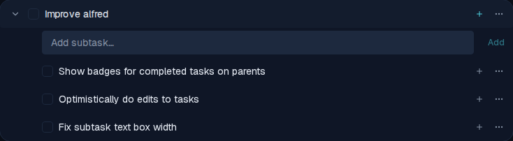

# Subtask entry box aligns with child checkboxes

*2026-06-12T18:46:50.395Z*

The 'Add subtask…' inline input was starting at the same x-position as the left edge of child rows — before the expand/collapse icon. It now starts aligned with the child checkboxes (and the parent's title text), at every depth level.

