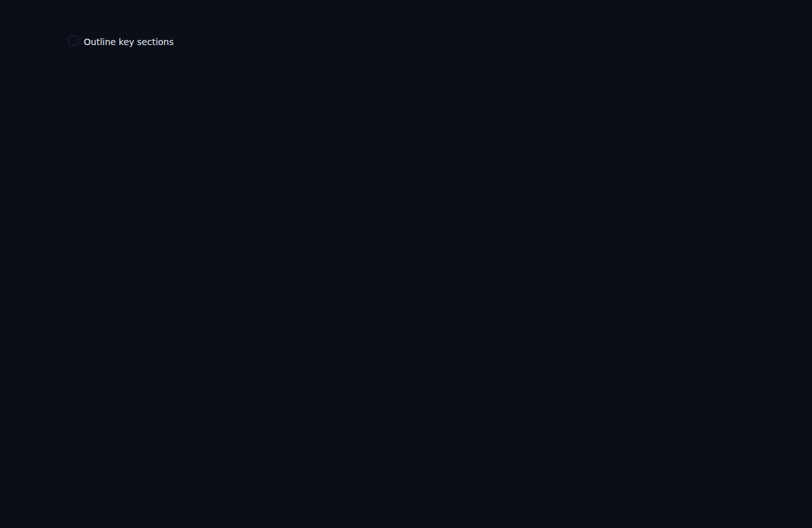
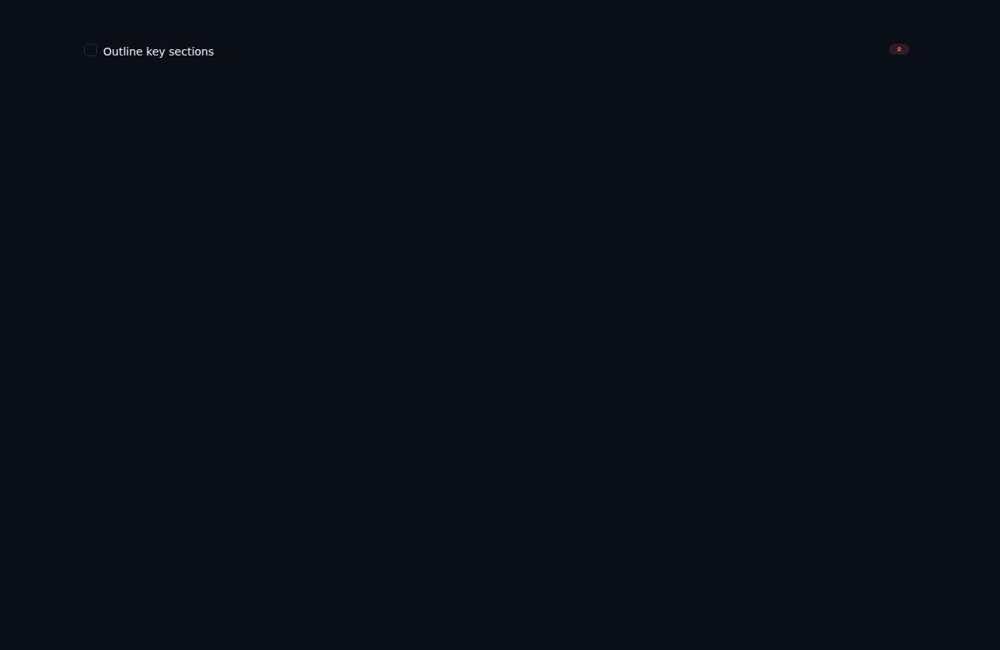

# Subtasks display their priority on the row (ALF-63)

*2026-07-01T04:03:02.652Z*

**Bug (ALF-63):** a subtask could have a priority set (via the detail panel's Priority chip, which is exposed for every task row), and that priority is ranked in the Folder view — but the priority chip never appeared on the subtask's own row. The row-level chip was gated on `isTopLevelTask`, so only top-level tasks showed it.

**Fix:** gate the row-level priority chip on `isTask` instead of `isTopLevelTask` — matching the Due-date chip right above it and the detail-panel Priority chip. Any task row (top-level or subtask) with a level set now shows its symbol-only priority chip. Recurrence stays top-level-only (unchanged).

The `Tasks/TaskRow` Storybook story **SubtaskWithPriority** renders a subtask (depth 1) with `priority: 'high'`. Below, *before* the fix vs *after*.

### Before — subtask row shows no priority chip

### After — the High-priority chip (red ChevronsUp) now shows on the subtask row

