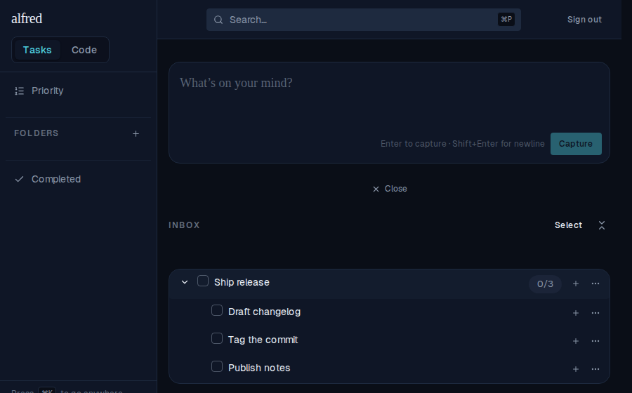
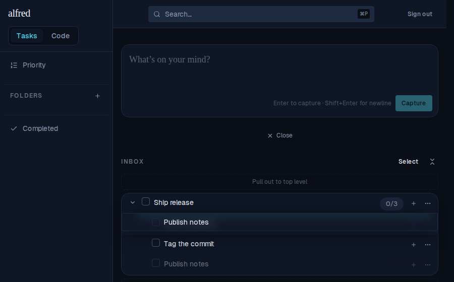
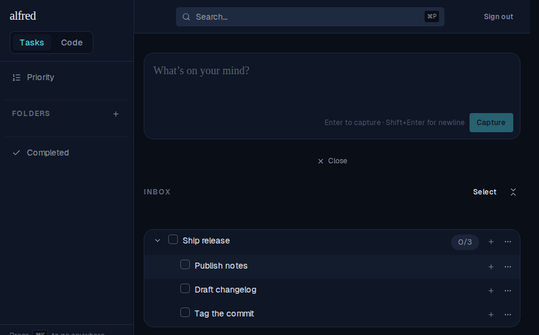
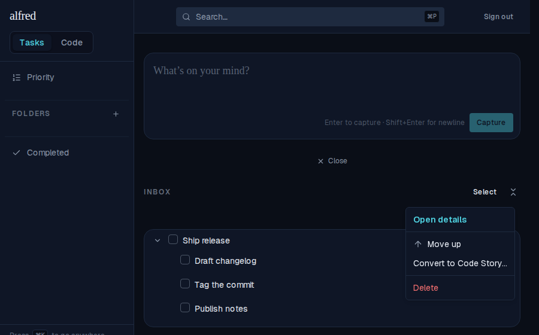

# Reorder subtasks — drag into gaps or use the row menu (ALF-117)

*2026-07-17T17:55:37.158Z*

A subtask group defaults to the order the subtasks were created; a manual sort overrides it. Roots are untouched (Inbox stays newest-first, the Folder view stays priority-ranked) — only subtasks become manually orderable, and priority stops reordering them (it stays a display signal).

## Drag a subtask into the gap between siblings

The "Ship release" task holds three subtasks in creation order: Draft changelog → Tag the commit → Publish notes.

Dragging "Publish notes" up: thin, layout-neutral drop strips sit at each sibling boundary. Hovering the gap above the first row reveals a teal insertion line marking the target slot (dropping on the row body would instead re-parent). The dragged row lifts as a translucent, neutral ghost under the cursor — teal is reserved for the drop indicator — while the in-place row dims and stays visible beneath.

Dropping in that gap sets a fractional sort_order at the midpoint of its neighbours (here, below the first row) — one row UPDATE, no renumber. "Publish notes" is now first, and the order persists across reloads and shows identically in Inbox, Folder, and By-Priority.

## Keyboard / screen-reader path: Move up / Move down

The row menu on an active subtask offers "Move up" and "Move down" — the deterministic, screen-reader-friendly reorder path. Each is hidden at the end of the group it can't move toward (here "Publish notes", the last subtask, shows only "Move up"), and neither appears on roots or in the Completed view. Each swaps the row past one sibling using the same fractional-midpoint math as a gap drop.

