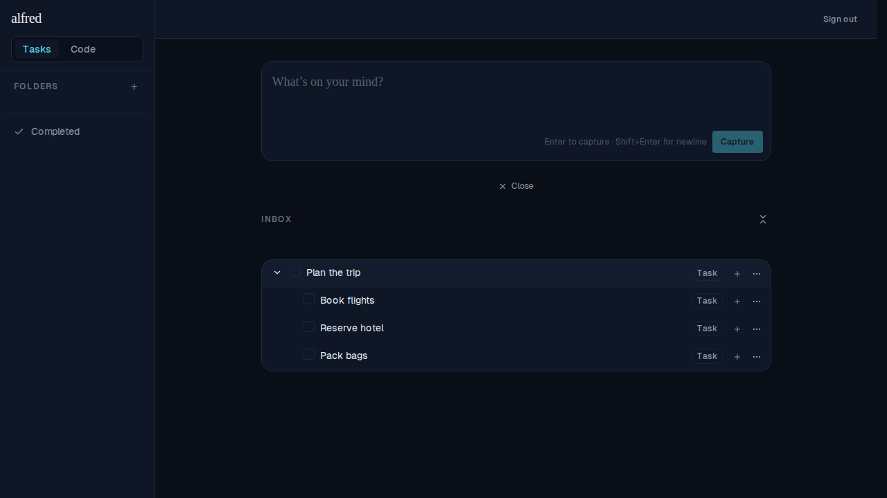

# Subtasks display in chronological order

*2026-06-23T18:48:08.141Z*

ALF-43: `buildTree`'s `sortForest` now orders **subtasks** by `created_at` **ascending** (oldest first) at every depth, while root tasks keep their newest-first ordering. Previously the most-recently-added subtask floated to the top, which reads backwards for a checklist you build top-to-bottom.

Below, a parent "Plan the trip" is seeded with three subtasks deliberately stored OUT of insertion order (array order: Pack bags, Book flights, Reserve hotel; created_at: 03-03, 03-01, 03-02). The only thing that can produce a correct top-to-bottom reading is the chronological sort.

Rendered order is **Book flights (03-01) → Reserve hotel (03-02) → Pack bags (03-03)** — oldest first, regardless of seed/array order. Captured via the Playwright mock harness so the rows pass through the store's `buildTree → sortForest` path (the real ordering code), not a hand-authored array.
