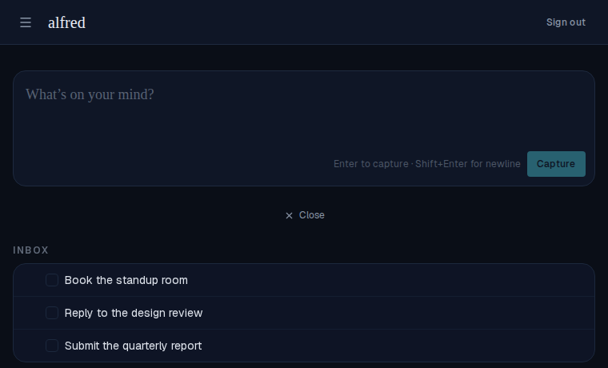

# Task completion animation

*2026-06-12T17:51:45.199Z*

Completing a task used to make its row vanish instantly. It now plays a deliberate two-beat exit: the checkbox gives a snappy scale "pop" the instant it's clicked, then the row's height collapses to zero — pulling the rows below up — while its title fades to a low-contrast colour.

Starting state — the inbox with three active tasks. We complete the middle one, "Reply to the design review":

Clicking its checkbox plays the exit: the checkbox pops and fills, then — a beat later — the row collapses its height to nothing (ease-out), the title fades out, and the two remaining tasks rise to close the gap.

