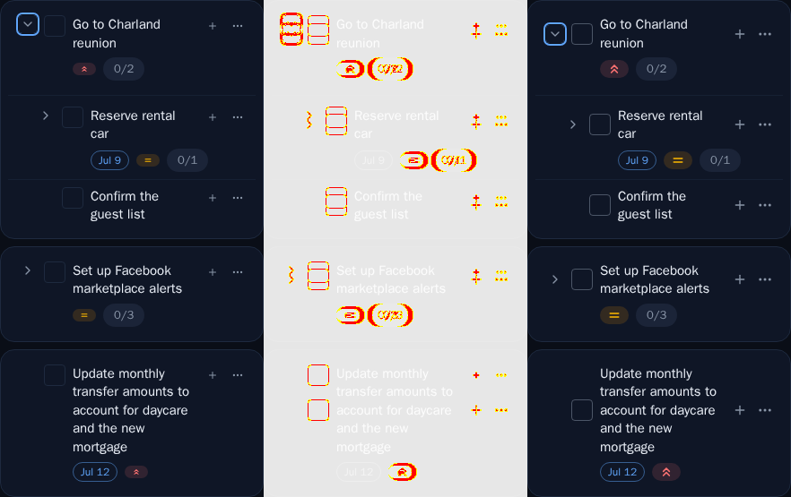

# Task item visual tweaks

*2026-07-03T00:25:22.580Z*

Four small visual tweaks to the task row, three of them mobile-only. All are locked by unit tests (task-row.styles, priority-chip) and captured by the two Storybook image snapshots below.

**Mobile card layout** — the `tasks-taskrow--mobile-cards` baseline moves. Reading the 3-panel diff (baseline | changed pixels | new render):
- **Completion checkbox is vertically centred** against the whole title block instead of pinned to the title's first line (see the two-line "Reserve rental car" and the four-line "Update monthly transfer amounts…" rows).
- **Checkbox border is more contrasty** — a mid-grey `muted-foreground/50` in place of the near-invisible `border` token (this one applies in every view, mobile and desktop).
- **Priority badge is bigger**, now the same height as the due-date pill, with a larger glyph inside.
- **The + (add subtask) and ⋯ (more actions) icons are bigger and vertically centred** against the title block.

**Checkbox border contrast (all views)** — the `atoms-checkboxbutton--unchecked` baseline moves too. The empty box's border steps up from the near-invisible `border` token to `muted-foreground/50`, so it's easy to spot at a glance.

