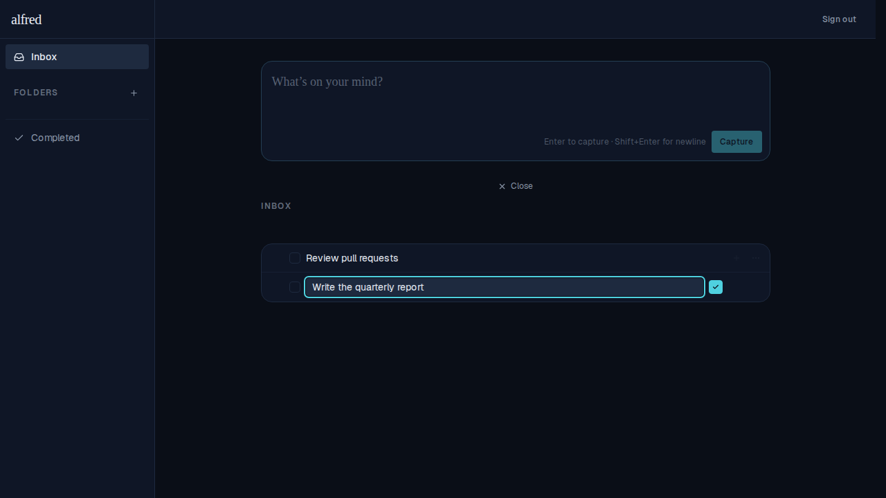
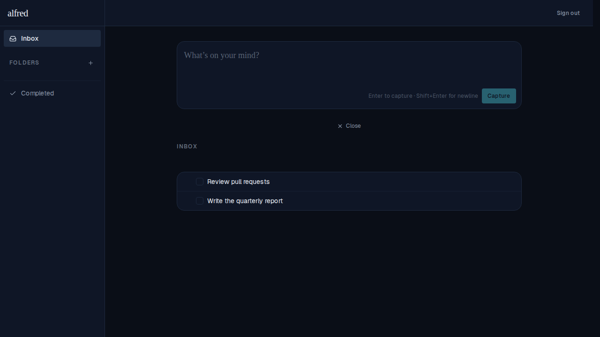
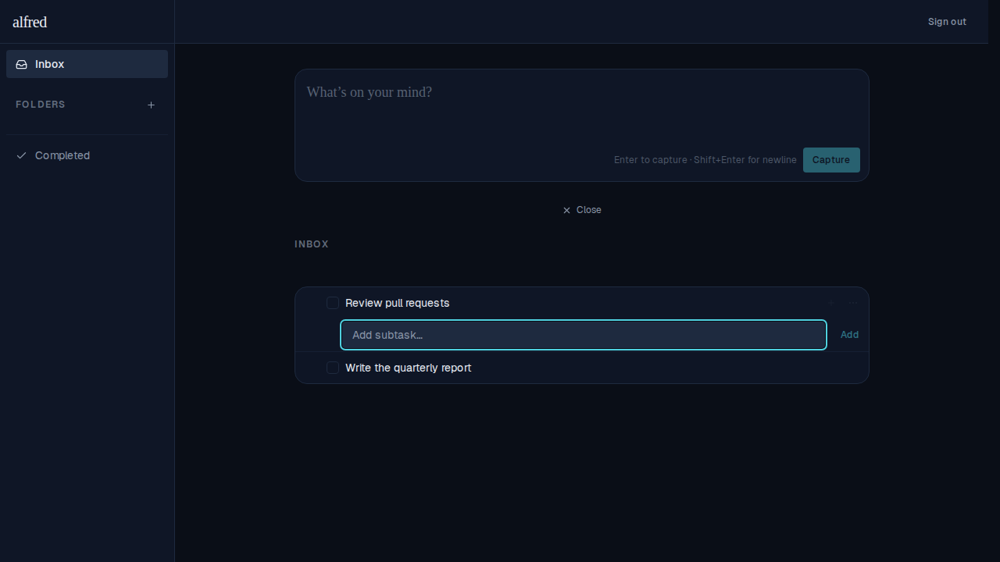
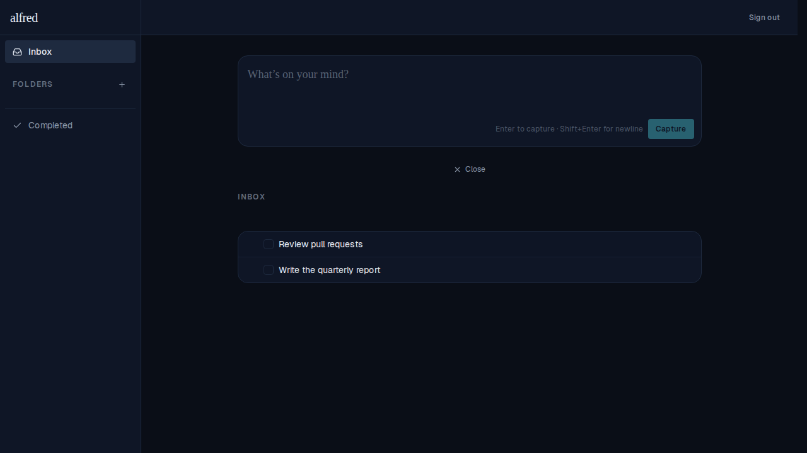

# Click-outside dismissal for edit-title and add-subtask text boxes

*2026-06-13T17:47:12.874Z*

When the edit-title input or add-subtask input is open, clicking anywhere outside now dismisses it. The edit-title input reverts to the task's read state (no save); the add-subtask input disappears entirely.

Implementation: onBlur + relatedTarget on a display:contents wrapper (edit-title) and on the compact form (add-subtask). The Add-subtask toggle button uses onMouseDown preventDefault to prevent a spurious blur+reopen cycle when toggling the box off.

## Edit title: enters edit mode on double-click

## Edit title: click outside reverts to read state

## Add subtask: input appears inline on click

## Add subtask: click outside dismisses the input

