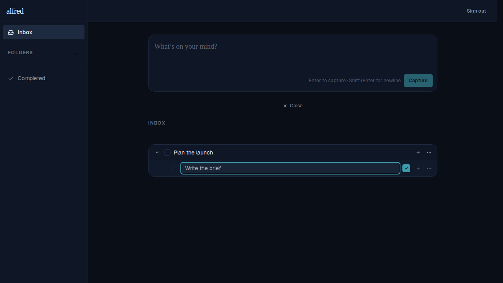
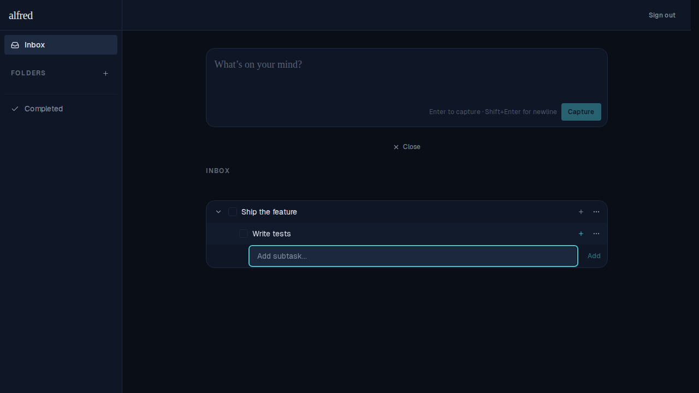
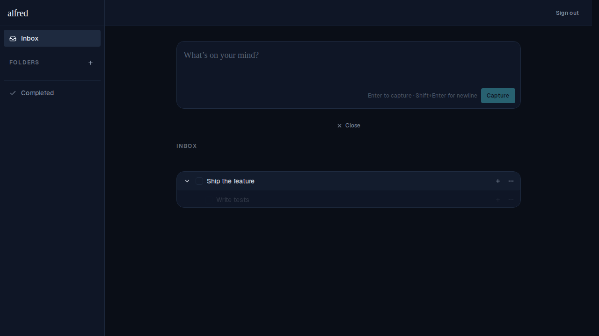

# Collapse parent clears open text boxes on descendants

*2026-06-13T17:51:03.019Z*

When a parent task is collapsed (hiding its children), any open inline text box on a descendant — either a title-edit textbox or an add-subtask capture box — is now closed immediately. Re-expanding the parent shows the descendants in their clean, non-editing state.

## Scenario 1: title-edit textbox cleared on collapse

**Before:** Parent "Plan the launch" is expanded; double-clicking the child "Write the brief" opens a title-edit textbox on it.

**After:** Parent collapses, then re-expands. The title-edit textbox is gone — the child renders as a plain task row again.

## Scenario 2: add-subtask capture box cleared on collapse

**Before:** Parent "Ship the feature" is expanded; clicking Add subtask on the child "Write tests" opens an add-subtask capture box below it.

**After:** Parent collapses, then re-expands. The add-subtask capture box is gone — the child renders as a plain task row with no open input.

