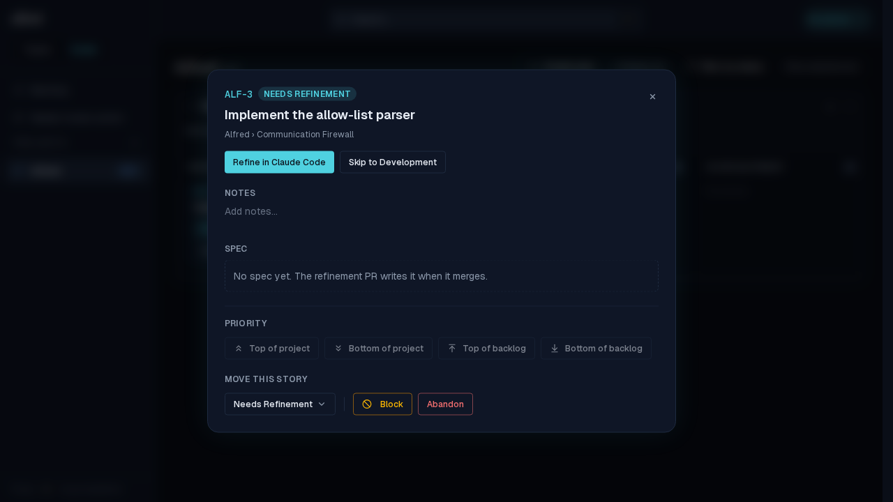
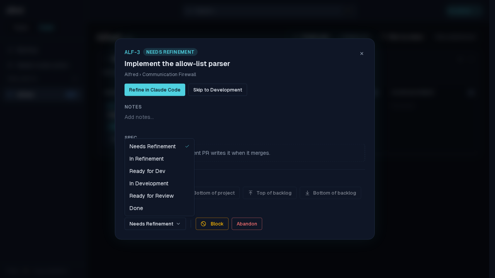
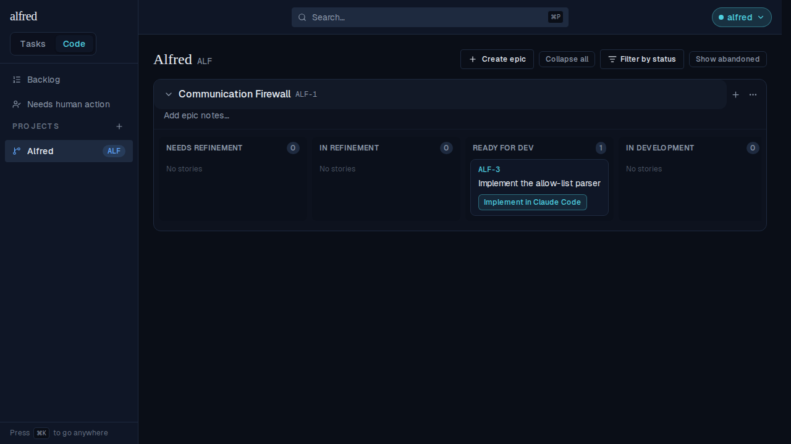
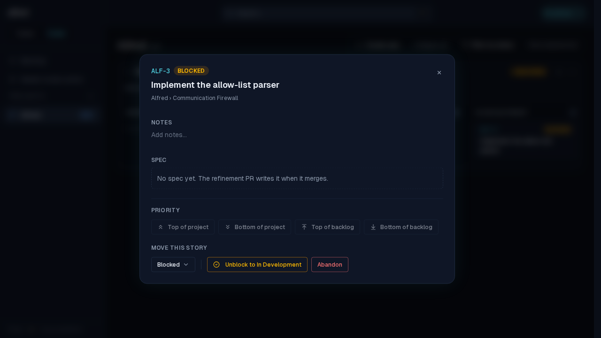
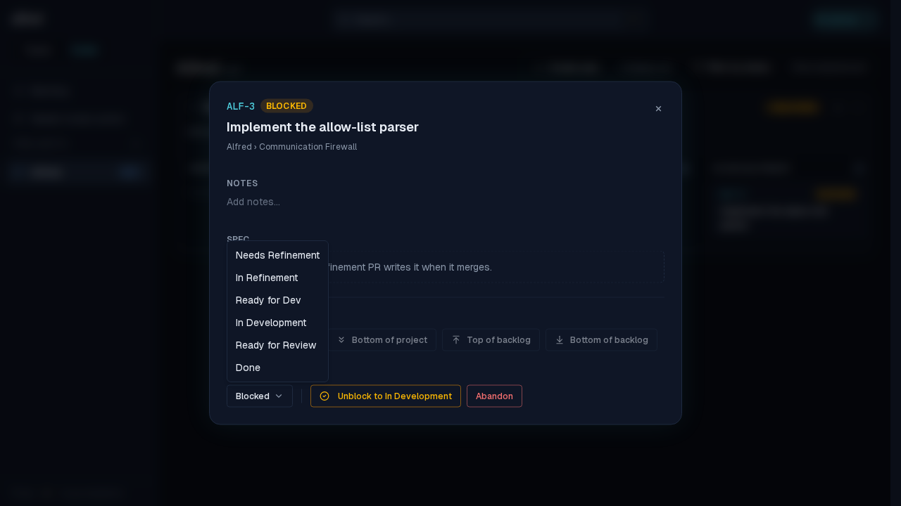
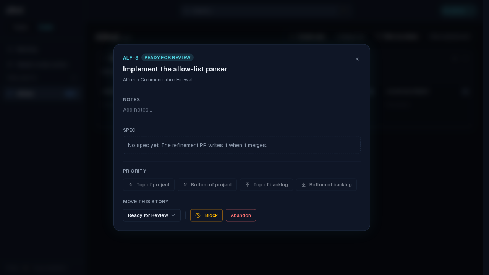
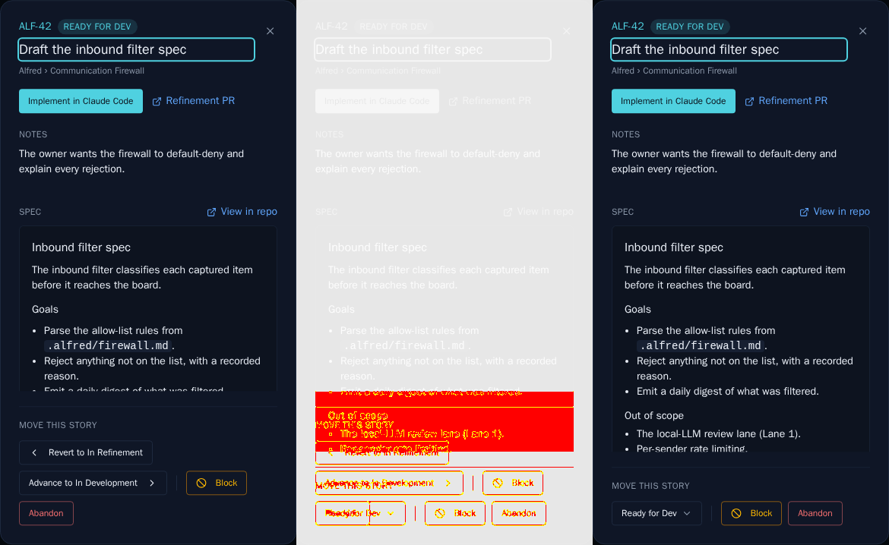

# Move a story with the status dropdown

*2026-07-26T12:12:37.577Z*

The story detail modal's **Move this story** row used to carry two one-step hop buttons — `Revert to …` and `Advance to …` — so reaching a lane two steps away took two round-trips, and at either end of the happy path one of them was dead. They are now a single dropdown listing every happy-path status, with the story's current one check-marked.

Opening it lists all six lanes in board order, the current one carrying a teal check.

Picking **Ready for Dev** jumps two lanes in one move — the old Advance button could only manage one. The header chip and the trigger both re-read the new status immediately (the optimistic store update).

## Blocked stories: the dropdown next to Unblock

A blocked story has no lane of its own, so nothing is check-marked — but every lane stays pickable. It sits beside the **Unblock** control, and the two do different jobs: Unblock is one click back to the lane the story was blocked *from* (`blocked_from`), while the dropdown sends it anywhere. Either way the blocked reason is cleared with the same write, because the PATCH route only forwards `blocked_reason` when the request carries the key — omit it and the story comes back unblocked but still carrying its old reason.

Picking **Ready for Review** — deliberately not the `in_development` lane it was blocked from — puts it there and drops the reason.

## The committed Storybook baselines moved

The snapshot gate emitted this three-panel diff for the phone-viewport modal story (baseline | changed pixels | received). At 390px the wrapped control rows collapse, which also pulls more of the spec above the fold. The regenerated baselines are committed alongside this doc.

