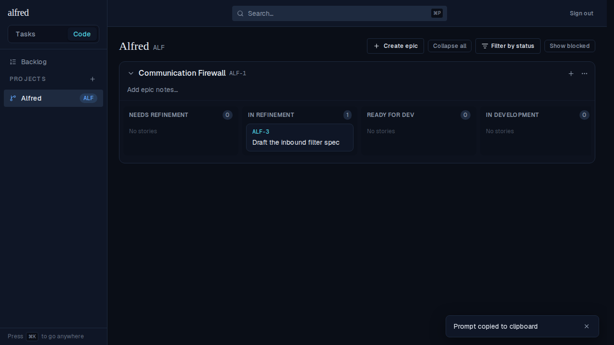
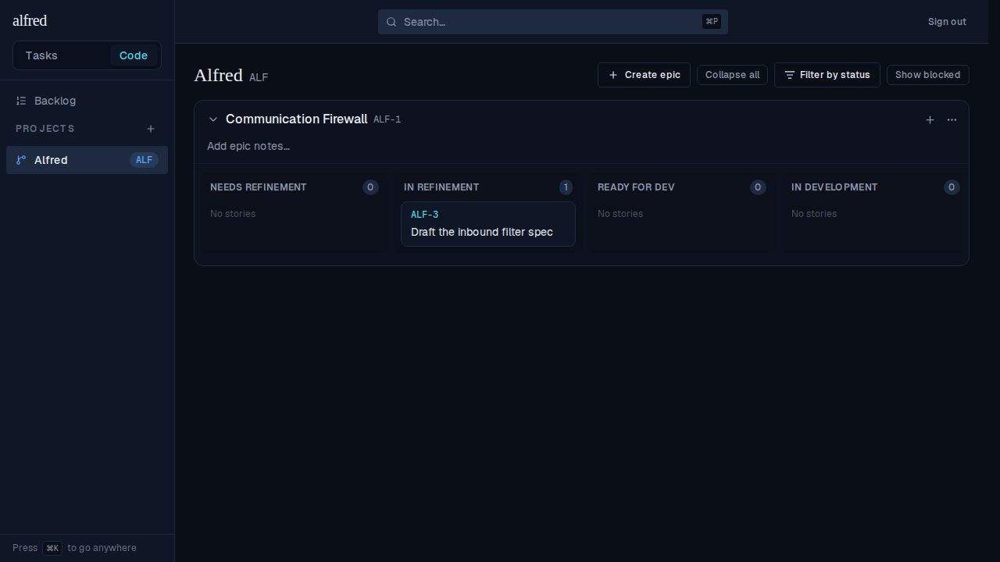

# Toasts wait for a hidden tab, then start their timer on refocus (ALF-77)

*2026-07-03T01:02:22.333Z*

ALF-77: a toast's 4s auto-dismiss countdown is now **visibility-gated** — it only runs while the browser tab is active (`!document.hidden`). A toast fired into a backgrounded tab is parked; a running countdown is cancelled and re-parked if the tab loses focus. Each time the tab regains focus (`visibilitychange` / window `focus`), every parked toast gets a **fresh** countdown, so the user never returns to a toast that expired unseen.

The evidence is the live `before → hidden → refocus` journey, driven through the app (a Refine-in-Claude-Code launch fires the "Prompt copied to clipboard" toast). The tab is backgrounded by shadowing `document.hidden` and dispatching `visibilitychange`, exactly as a real tab switch does.

**1. The toast appears** (tab active):

**2. Tab backgrounded, then 5s elapse — past the 4s auto-dismiss window.** The toast is still there: before this change the countdown would have cleared it at 4s, so the user would return to nothing.

**3. Tab regains focus; a fresh 4s countdown starts and completes.** The toast animates out and is gone — the timer starts on refocus, exactly as the ticket asks.

