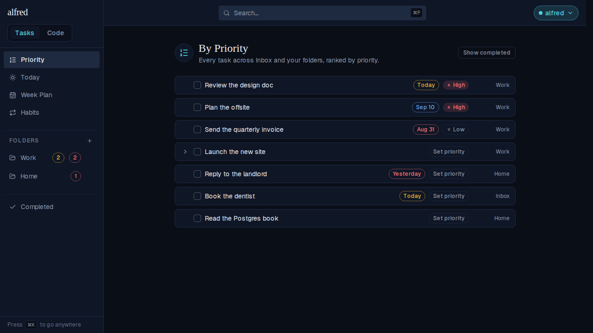
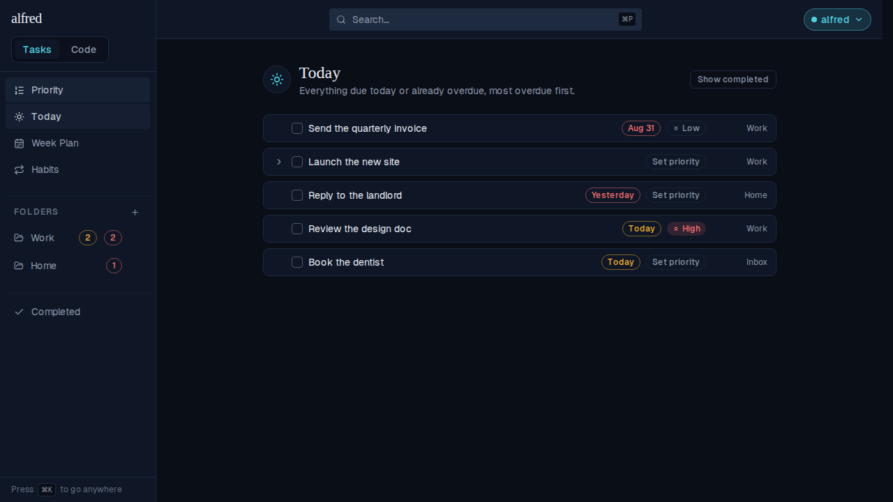
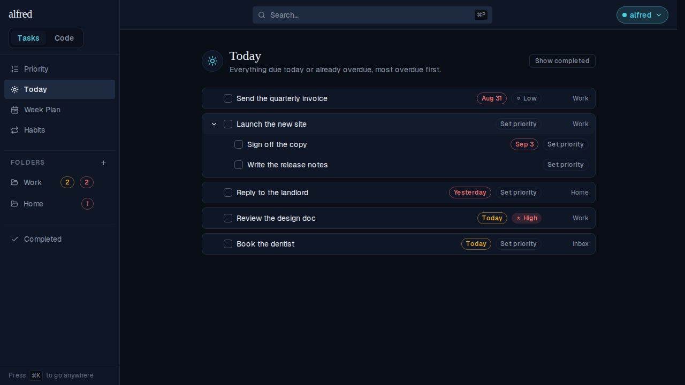
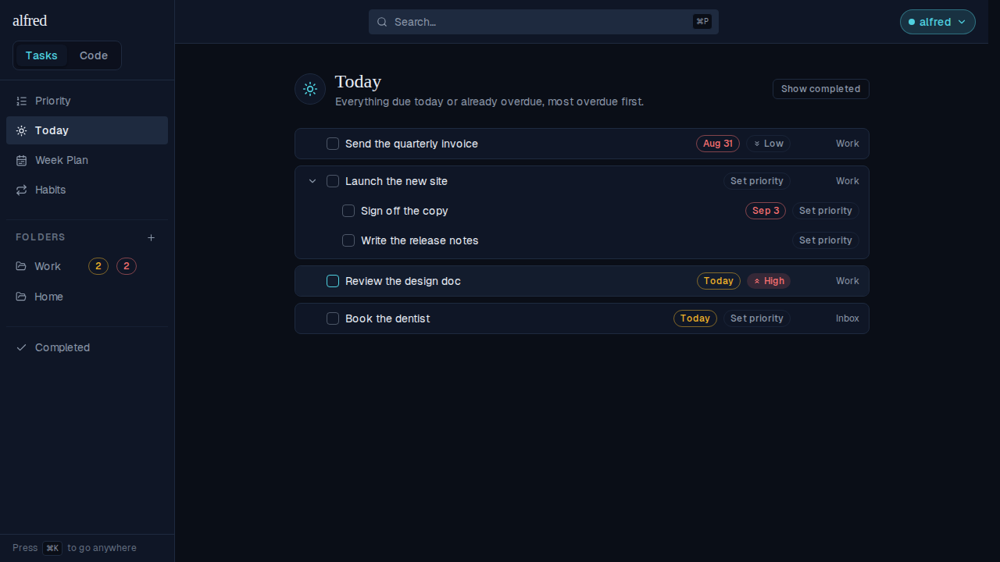
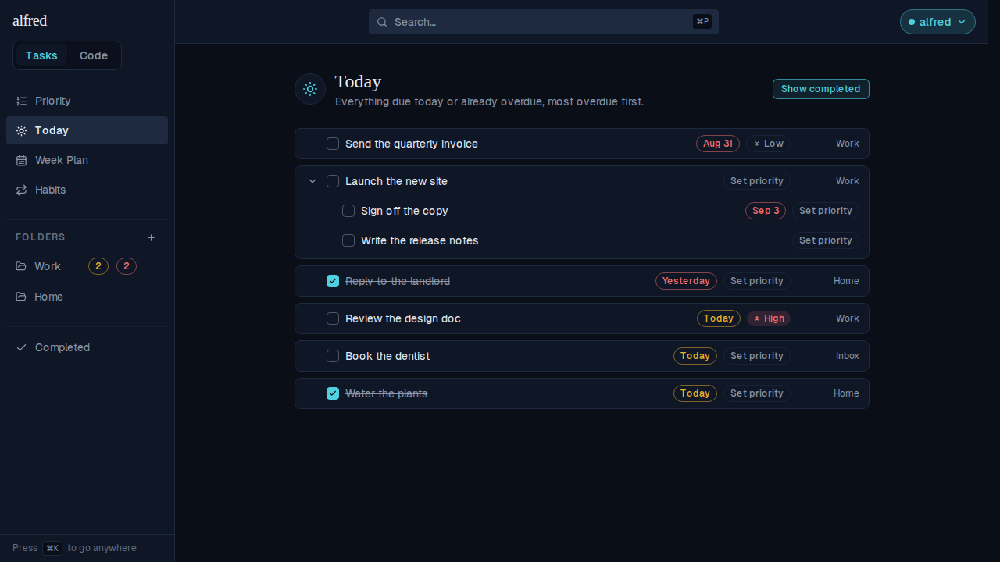

# A Today tab: everything due today or overdue

*2026-09-06T01:45:55.679Z*

ALF-106 adds a **Today** tab to the tasks module — a task view ranked directly under Priority in the sidebar, listing every top-level task that is due today or already overdue.

## Where it sits: ranked under Priority

The sidebar gains a Today link immediately beneath Priority. For contrast, here is the same seed on By Priority — importance leads there, so a High-priority task due next week ("Plan the offsite", Sep 10) sits second, above tasks that are already late.



## The list: due today or overdue, most overdue first

Clicking Today shows the same seed filtered and reordered. Urgency leads here: the deadline decides the order and the priority level only breaks a same-day tie, so the Low-priority invoice from Aug 31 outranks the High-priority doc due today.

The two rows that never had a deadline in play are gone — "Plan the offsite" (due Sep 10, High) and "Read the Postgres book" (no due date) — because neither is due yet.



## A deadline can't hide inside a collapsed parent

"Launch the new site" has no due date of its own. It appears because an active subtask — "Sign off the copy", due Sep 3 — is overdue, and it sorts by that subtask's date rather than by its own (absent) one. Expanding the row reveals what pulled it in, alongside its undated sibling.



## Working the list down

Rows are real task components, not a read-only index: ticking "Reply to the landlord" completes it and drops it straight out of the list.



Show completed brings back what the day has already closed out — the task just ticked off, plus "Water the plants", which was seeded complete.



## The rule itself

The filter and the ordering live in one pure function, `rankDueToday`, so the store selector, the view and its tests all share one definition of "due today":

```bash
sed -n '/^export function rankDueToday/,/^}/p' frontend/lib/tasks/due-today.ts
```

```output
export function rankDueToday(roots: readonly ItemNode[], showCompleted: boolean): ItemNode[] {
  const visible = roots.filter(
    (node) => (showCompleted || node.status === 'active') && isDueInSubtree(node),
  );
  return stableSorted(
    visible,
    (a, b) =>
      compareKeyByDue(urgentKey(a), urgentKey(b)) ||
      Date.parse(a.created_at) - Date.parse(b.created_at),
  );
}
```
