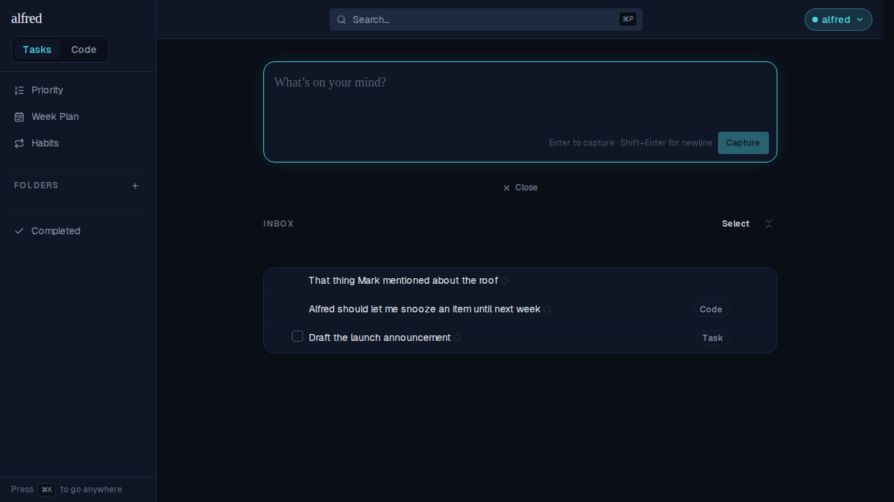
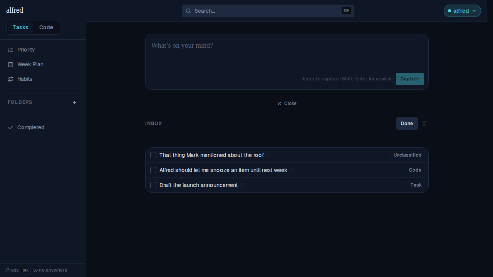
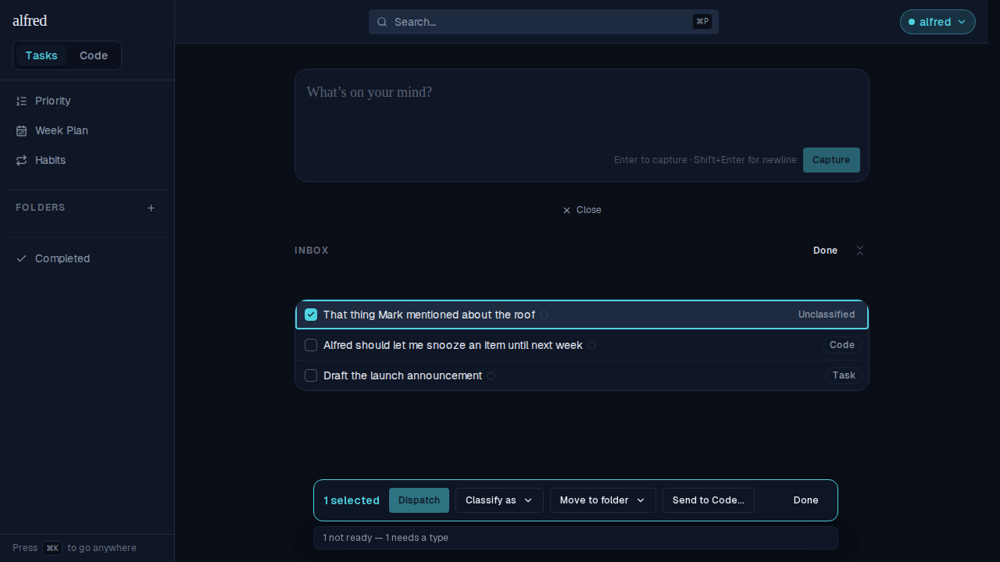
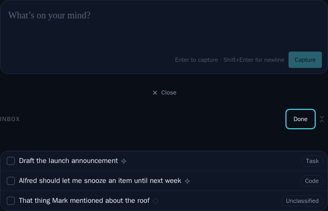

# Type badge (Task / Code / Unclassified) in the Inbox multi-select view

*2026-08-28T14:50:51.160Z*

ALF-105. Select mode is where the Inbox's three item types stop being background context and become the input to a press: Classify needs a childless root, Move refuses a code row, and Dispatch skips an unclassified one. Until now an untriaged row wore no badge at all, so it was the one row whose eligibility you could not read off the row itself.

The change: TypeBadge gains a third label, and TaskRow shows it in select mode only. Browsing the Inbox is untouched — there, "no badge yet" stays the quieter, already-correct signal.

## Before — browsing the Inbox

Three captures: a task, a code item, and an untriaged one. The first two name themselves; the third says nothing. Unchanged by this ticket.

## Action — press Select

Every row now names its type. The untriaged capture wears "Unclassified", in the same muted pill as Task and Code: it is one value of a three-way field, not an alert.

## After — select the untriaged row

The bulk bar's readiness line reads "1 not ready — 1 needs a type", and now the row it is talking about says so on its own face. The badge is inert inside the row's single toggle button, like every other select-mode chip.

## The committed visual baselines

The Storybook snapshot gate caught the intended move on `Tasks/TypeBadge → Unclassified`: baseline (an empty frame — the badge used to render nothing), the changed pixels in red, and the received render. Approved with `npm run test:storybook:update -w frontend`; the regenerated PNG ships with this branch.

And a new story, `Tasks/InboxScreen → SelectMode`, pins all three badges side by side in select mode — a play function presses Select, and the snapshot is its committed baseline.

