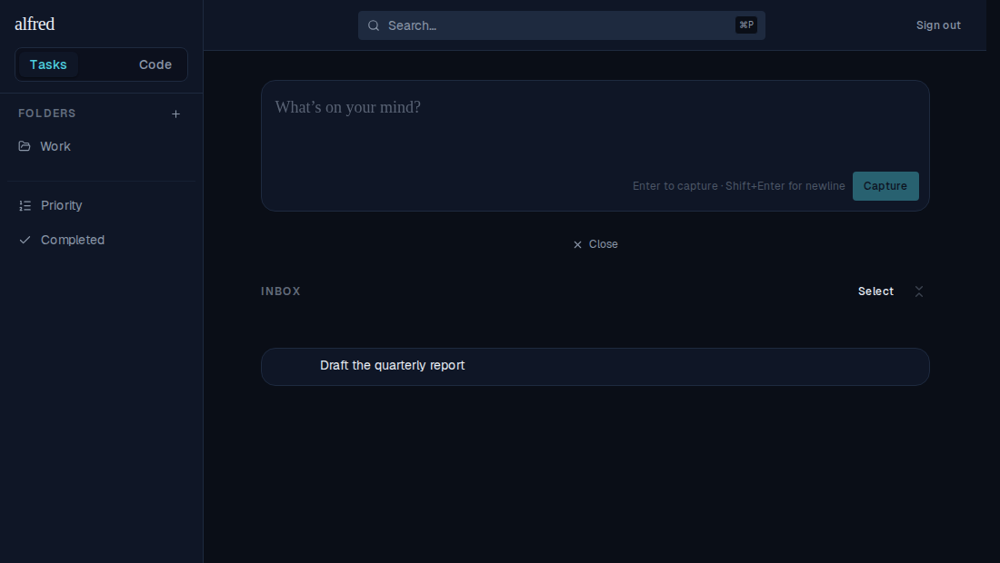
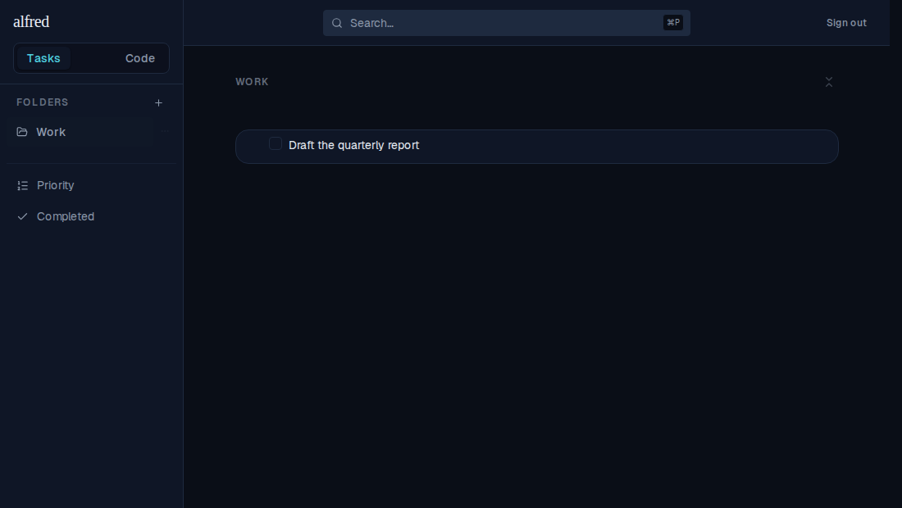

# Filing an unclassified item into a folder classifies it as a task (ALF-72)

*2026-07-01T04:10:33.501Z*

Folders hold tasks. Before ALF-72, dragging or moving an unclassified inbox item into a folder only set its `folder_id` — it stayed `unclassified`, so it landed in the folder with none of the task affordances (no completion checkbox, no subtasks). Now `moveTask` also flips any still-unclassified item to `item_type: 'task'` when filing it into a folder (moving to the Inbox classifies nothing, and an existing task/code item keeps its type).

**Before** — the captured item "Draft the quarterly report" sits in the Inbox as an unclassified item: its leading control is a blank spacer, not a completion checkbox.

**After** — using the row's "More actions ▸ Move to… ▸ Work" menu files it into the Work folder. It now renders as a task there, with the completion checkbox unlocked — it was classified as a task by the move.

