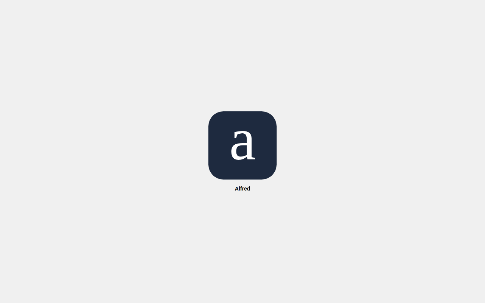

# Web app icon styling: border radii, Lora font, Alfred title

*2026-06-16T16:26:53.821Z*

Three changes to the web app home-screen icon:
1. Removed the baked-in border radius from both the SVG favicon (rx attribute) and the apple-icon.tsx PNG generator (borderRadius style). iOS applies its own mask, so the extra inner rounding was creating a visible white gap between the image corners and the iOS icon frame.
2. Swapped the font from Liberation Serif (a Times New Roman substitute) to Lora (Google Fonts), bundled as a local TTF at public/fonts/lora.ttf. The apple-icon.tsx ImageResponse generator uses this file directly; the SVG favicon specifies 'Lora, Georgia, serif' in its font-family stack.
3. Changed the Next.js metadata title from 'alfred' to 'Alfred' so the label that appears beneath the icon on the home screen reads with a capital A.

The screenshot below simulates how the icon appears on a home screen. The actual apple-icon.tsx generates a square 180×180 PNG using the bundled lora.ttf; iOS applies its own rounded mask over the full image.



```bash
cat frontend/app/icon.svg
```

```output
<svg xmlns="http://www.w3.org/2000/svg" viewBox="0 0 32 32">
  <rect width="32" height="32" fill="#1E2A3F"/>
  <text x="16" y="23" text-anchor="middle" fill="white"
        font-family="Lora, Georgia, serif" font-size="28" font-weight="400">a</text>
</svg>
```

```bash
grep -A5 'title' frontend/app/layout.tsx | head -6
```

```output
  title: 'Alfred',
  description: 'A capture-first personal task system',
};

export default function RootLayout({
  children,
```
