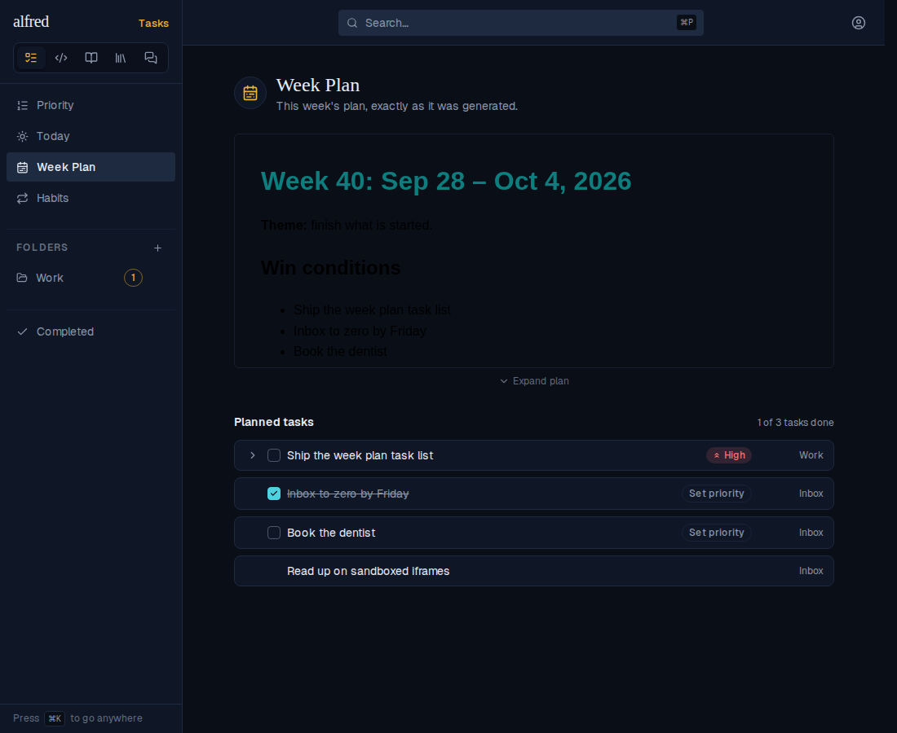
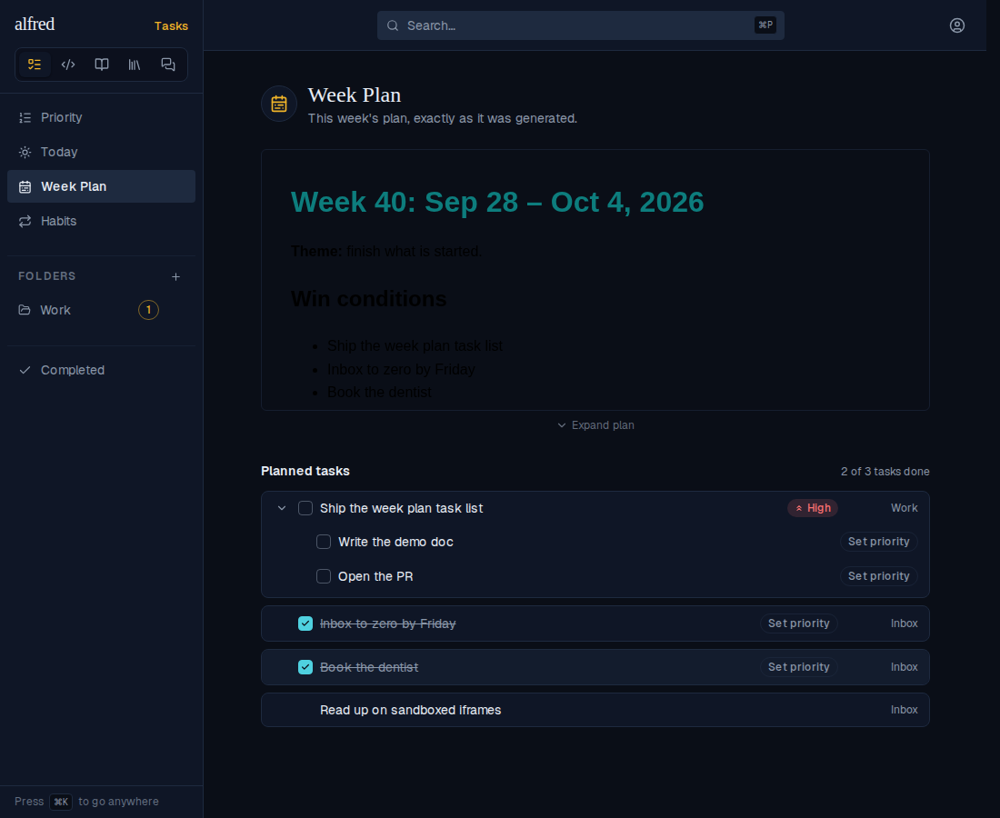
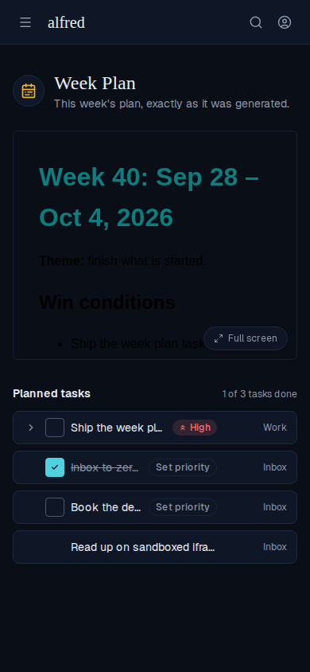

# Week Plan: the plan's tasks under a short, expandable preview

*2026-09-30T05:15:55.550Z*

ALF-235. The Week Plan view used to be the plan document alone, filling the screen. Now it opens as a short preview with the items the weekly review created against that plan (items.weekly_plan_id) listed underneath: in plan order, with finished ones still shown (struck through) under an "N of M tasks done" tally. Rows are the same TriageRow the Today and By Priority views use, so you get a checkbox, subtasks behind a chevron, and the folder label. Captured with the Playwright mock harness at /plan.

**1. Landing on /plan.** The document preview, then Planned tasks. The ordinary capture seeded alongside isn't in the list, and the knowledge row doesn't count toward the tally because it can't be ticked off.

**2. Working the list.** Expanding the parent shows its subtasks. Ticking "Book the dentist" strikes it through in place and moves the tally to 2 of 3. It stays listed, because the list is a record of the week.

**3. Expand / Collapse (desktop).** The toggle grows the frame to 80vh and shrinks it back, animating the height.

**4. Phone.** The Expand toggle is hidden because the existing tap-to-full-screen layer already gives the document the whole screen. The task list sits under the preview as on desktop.

