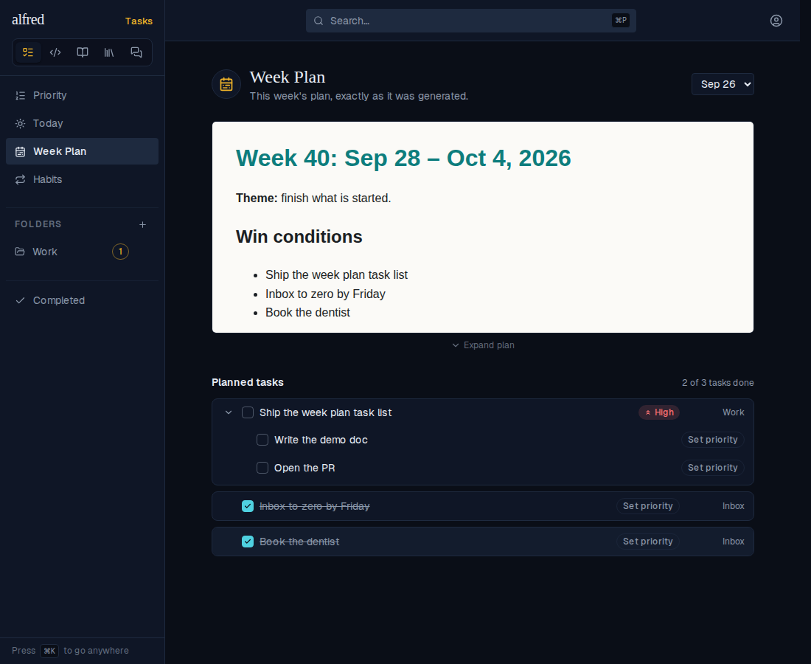
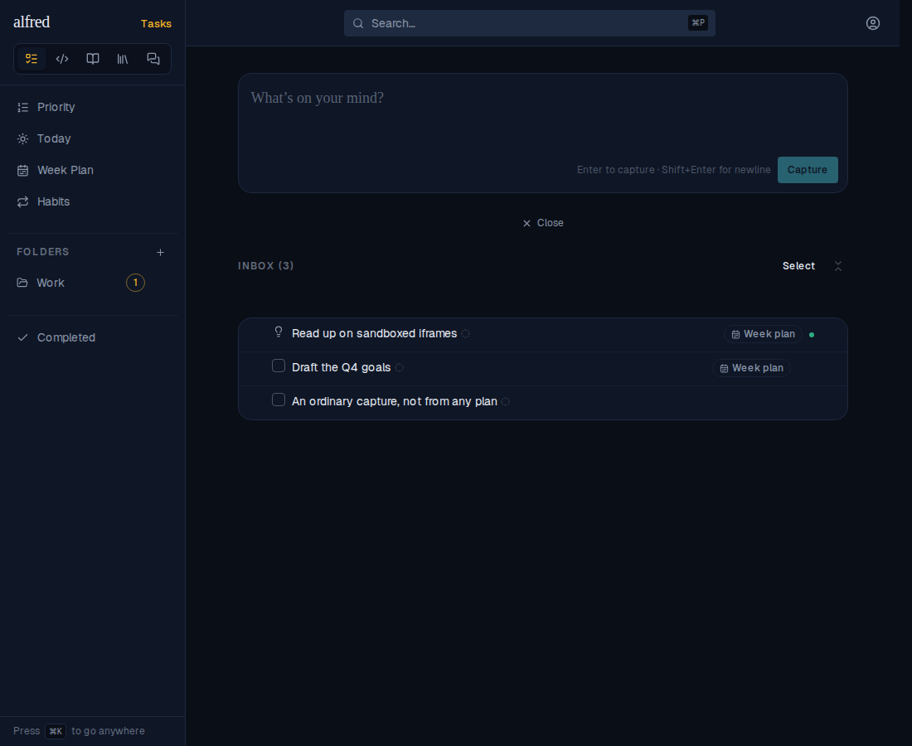
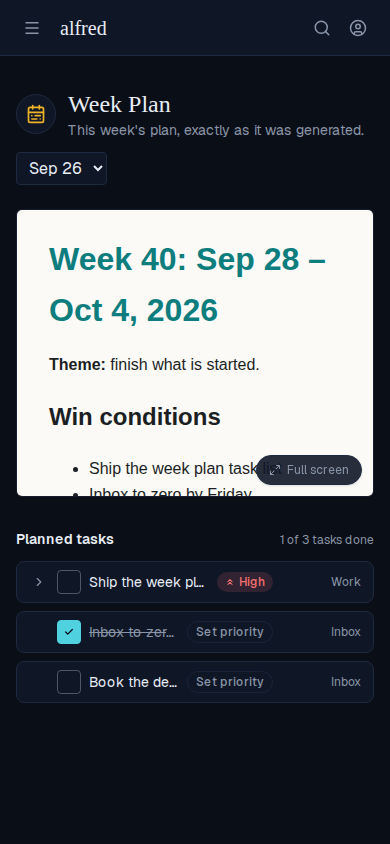
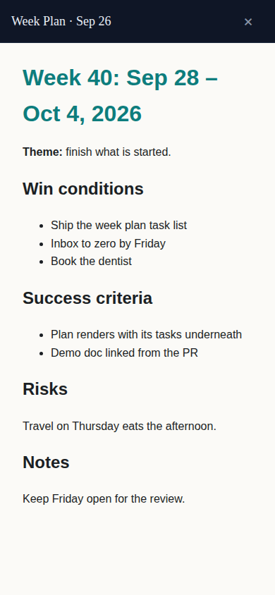

# Week Plan: the plan's tasks under a short, expandable preview

*2026-09-30T12:35:54.490Z*

ALF-235. The Week Plan view used to be the plan document on its own, filling the screen. Now it opens as a **short preview** with the **tasks** the weekly review created against that plan (items.weekly_plan_id) listed underneath. The list is in plan order, keeps finished tasks (struck through), and sits under an "N of M tasks done" tally. Rows are the TriageRow that Today and By Priority use. Captured through the Playwright mock harness. The seed holds two archived plans, this week's items (four tasks, one of them a subtask pair's parent, plus a knowledge row), last week's two tasks, and one ordinary capture from no plan. The stand-in plan document pins a light background so it reads; the real one ships its own light/dark tokens.

**1. Landing on /plan (latest week).** The document preview, then the three planned tasks in plan order. The one already done is struck through, and the tally reads 1 of 3. The knowledge row this plan also created is not listed: the list is tasks only.

**2. Expanding a planned task** shows the subtasks the review created under it.

**3. Ticking "Book the dentist"** strikes it through in place, where it stays, and moves the tally to 2 of 3.

**4. Picking last week (Sep 19)** swaps the document, and the list follows it: last week's two tasks, 1 of 2 done. Nothing from this week carries over.

**5. The Inbox**, for contrast. The ordinary capture from no plan lives here and was in neither week's list. The knowledge row and last week's open task (both carrying the Week plan badge) are here too.

**6. Expand / Collapse (desktop).** The toggle animates the frame from the short preview up to 80vh and back.

**7. Phone.** The Expand toggle is hidden at this width; the existing Full screen chip is the way in. The task list sits under the preview as on desktop.

**8. Tapping the preview** still opens the plan full screen.

