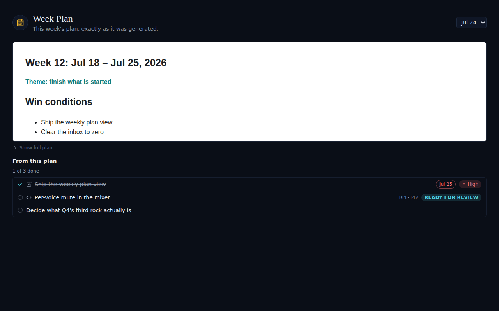
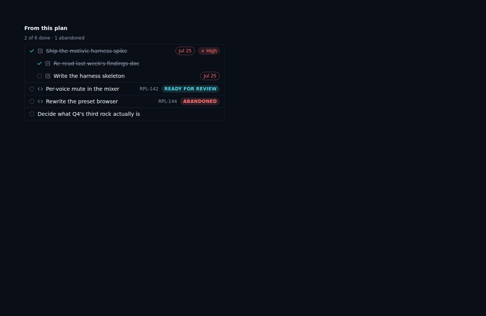

# Week Plan view: a shorter, expandable frame with the plan's tasks and code stories underneath

*2026-09-23T04:12:45.760Z*

ALF-235: the Week Plan view (tasks module) used to be a full-height iframe of the review's HTML document and nothing else. It now opens shortened — a preview height — with a "Show full plan" toggle that expands it in place, and underneath it lists the tasks and code stories the review created against that plan (weekly_plan_items, ALF-195's cohort read), each with its done/open state, a code story's ref and factory-state, and any due date / priority it carries.

The Populated Week Plan view: the plan document opens shortened (a "Show full plan" toggle below it), and underneath, "From this plan" lists the tasks and code stories the review created — a completed task (strikethrough, its due date and priority still shown), a code story in review with its ref and factory state, and an unclassified capture never touched.

The item cohort in more depth (the WeeklyPlanItems component in isolation): a completed task's subtasks nest underneath it, a code story in review sits beside one an owner abandoned, and a bare capture never classified stays at the bottom — one vocabulary across both item families, exactly as create_weekly_plan_items / GET /api/weekly-plans/[id]/items already publish it (ALF-195).

The expand toggle, live: "Show full plan" grows the frame from its shortened preview height to the full document in place — a plain CSS height transition, not a modal or a reload.

