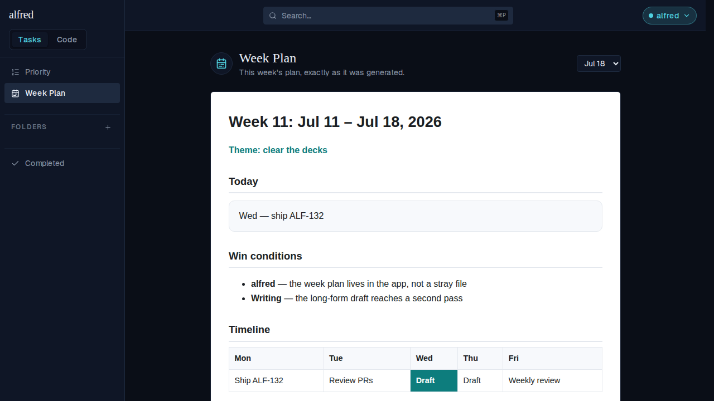
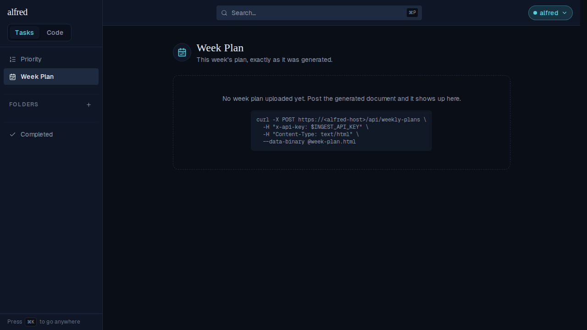

# Week Plan: upload endpoint + tasks-module view

*2026-07-25T21:16:12.674Z*

Every Friday the weekly-review skill emits a single self-contained HTML document — the week's theme, win conditions, a day-by-day timeline, success criteria. It used to live wherever the desktop session dropped it. This adds a keyed **upload endpoint** so it can be posted into alfred the moment it is generated, and a **Week Plan view** in the tasks module that renders it in a sandboxed iframe, alongside By-Priority in the sidebar.

## 1. Uploading the document

`POST /api/weekly-plans` takes the file as a **raw body**, not JSON — the ergonomic call is `--data-binary @week-plan-12.html`, and JSON-escaping a 40 KB document from a shell is hostile. Auth is the existing keyed ingress (`resolveIngestClient`), the same one the Siri capture path uses. Below, the app runs against the in-memory Supabase backend the E2E suite wires up — real route handler, real Supabase client, no live database.

```bash
cd frontend
# Boot the app against the in-memory Supabase backend the e2e suite uses — real route
# handler, real Supabase client, no live database.
export MOCK_SUPABASE_PORT=54331 INGEST_API_KEY=demo-ingest-key
export NEXT_PUBLIC_SUPABASE_URL=http://localhost:54331 \
       NEXT_PUBLIC_SUPABASE_ANON_KEY=sb_publishable_mock \
       SUPABASE_SERVICE_ROLE_KEY=sb_secret_mock
[ -d .next ] || npm run build >/dev/null 2>&1
node scripts/mock-supabase.mjs >/dev/null 2>&1 & MOCK=$!
npm run start -- -p 3010 >/dev/null 2>&1 & APP=$!
# `npm run start` spawns next-server as a child, so kill the child too or it outlives the
# block and holds the port.
cleanup() { pkill -P "$APP" 2>/dev/null; kill "$APP" "$MOCK" 2>/dev/null; }
trap cleanup EXIT
until curl -sf localhost:54331/__mock__/health >/dev/null 2>&1; do sleep 0.2; done
until curl -s -o /dev/null localhost:3010/login 2>/dev/null; do sleep 0.5; done

cat > /tmp/week-plan-12.html <<'HTML'
<!DOCTYPE html>
<html lang="en"><head><meta charset="utf-8" /><title>Week 12: Jul 18 – Jul 25, 2026</title>
<style>body { max-width: 780px; margin: 0 auto; padding: 2rem; }</style></head>
<body><h1>Week 12: Jul 18 – Jul 25, 2026</h1><p>Theme: finish what is started</p>
<script>document.title = document.title;</script></body></html>
HTML

echo "POST /api/weekly-plans  --data-binary @week-plan-12.html"
STATUS=$(curl -sS -o /tmp/upload.json -w '%{http_code}' -X POST localhost:3010/api/weekly-plans \
  -H "x-api-key: $INGEST_API_KEY" -H 'Content-Type: text/html' \
  --data-binary @/tmp/week-plan-12.html)
echo "  -> HTTP $STATUS"
node -e '
const body = require("/tmp/upload.json");
console.log("  -> body keys:", Object.keys(body).join(", "));
console.log("  -> id is a uuid:", /^[0-9a-f]{8}(-[0-9a-f]{4}){3}-[0-9a-f]{12}$/.test(body.id));
console.log("  -> uploaded_at is a timestamp:", !Number.isNaN(Date.parse(body.uploaded_at)));
'
# The document must be archived byte-for-byte — it is rendered, never sanitized.
node -e '
const { readFileSync } = require("node:fs");
const { createHash } = require("node:crypto");
const sha = (s) => createHash("sha256").update(s).digest("hex");
fetch("http://localhost:54331/__mock__/state").then((r) => r.json()).then((state) => {
  const uploaded = readFileSync("/tmp/week-plan-12.html", "utf8");
  console.log("  -> rows in weekly_plans:", state.weeklyPlans.length);
  console.log("  -> stored document identical to the file:", sha(state.weeklyPlans[0].html) === sha(uploaded));
});
'
```

```output
POST /api/weekly-plans  --data-binary @week-plan-12.html
  -> HTTP 201
  -> body keys: id, uploaded_at
  -> id is a uuid: true
  -> uploaded_at is a timestamp: true
  -> rows in weekly_plans: 1
  -> stored document identical to the file: true
```

## 2. Every validation rule, and who may read

The handler rejects each malformed shape with its own status and the shared `{ error }` envelope. Reading one archived plan back is deliberately **session-only** — the ingress key is a write credential, so it buys nothing on `GET`.

```bash
cd frontend
export MOCK_SUPABASE_PORT=54331 INGEST_API_KEY=demo-ingest-key
export NEXT_PUBLIC_SUPABASE_URL=http://localhost:54331 \
       NEXT_PUBLIC_SUPABASE_ANON_KEY=sb_publishable_mock \
       SUPABASE_SERVICE_ROLE_KEY=sb_secret_mock
[ -d .next ] || npm run build >/dev/null 2>&1
node scripts/mock-supabase.mjs >/dev/null 2>&1 & MOCK=$!
npm run start -- -p 3010 >/dev/null 2>&1 & APP=$!
# `npm run start` spawns next-server as a child, so kill the child too or it outlives the
# block and holds the port.
cleanup() { pkill -P "$APP" 2>/dev/null; kill "$APP" "$MOCK" 2>/dev/null; }
trap cleanup EXIT
until curl -sf localhost:54331/__mock__/health >/dev/null 2>&1; do sleep 0.2; done
until curl -s -o /dev/null localhost:3010/login 2>/dev/null; do sleep 0.5; done

printf '<!DOCTYPE html><html><body><h1>Week 12</h1></body></html>' > /tmp/plan.html
printf '# Just some markdown\n' > /tmp/plan.md
: > /tmp/empty.html
node -e 'require("node:fs").writeFileSync("/tmp/huge.html", "<!DOCTYPE html><html><body>" + "x".repeat(1024*1024) + "</body></html>")'

# The generated id and timestamp differ every run; mask them so this block re-verifies.
redact() {
  node -e 'let d="";process.stdin.on("data",(c)=>{d+=c}).on("end",()=>{
    console.log(d.replace(/"[0-9a-f]{8}(-[0-9a-f]{4}){3}-[0-9a-f]{12}"/g, "\"<uuid>\"")
                 .replace(/"\d{4}-\d{2}-\d{2}T[^"]+"/g, "\"<timestamp>\""))})'
}

# Each row: the request, then the status + envelope the handler returns.
try() {
  printf '%-38s -> ' "$1"; shift
  curl -sS -o /tmp/err.json -w 'HTTP %{http_code}  ' -X POST localhost:3010/api/weekly-plans "$@"
  redact < /tmp/err.json
}

try 'valid key + text/html'      -H "x-api-key: $INGEST_API_KEY" -H 'Content-Type: text/html' --data-binary @/tmp/plan.html
try 'no credential'              -H 'Content-Type: text/html' --data-binary @/tmp/plan.html
try 'wrong Content-Type'         -H "x-api-key: $INGEST_API_KEY" -H 'Content-Type: application/json' --data-binary @/tmp/plan.html
try 'empty body'                 -H "x-api-key: $INGEST_API_KEY" -H 'Content-Type: text/html' --data-binary @/tmp/empty.html
try 'body is not a document'     -H "x-api-key: $INGEST_API_KEY" -H 'Content-Type: text/html' --data-binary @/tmp/plan.md
try 'body over 1MB'              -H "x-api-key: $INGEST_API_KEY" -H 'Content-Type: text/html' --data-binary @/tmp/huge.html
try 'wrong key'                  -H 'x-api-key: not-the-key' -H 'Content-Type: text/html' --data-binary @/tmp/plan.html

# Reading one archived plan is session-only: the ingress key is a write credential.
printf '%-38s -> ' 'GET one plan, key but no session'
curl -sS -o /tmp/get.json -w 'HTTP %{http_code}  ' \
  -H "x-api-key: $INGEST_API_KEY" \
  localhost:3010/api/weekly-plans/e4f5a6b7-c8d9-4e0f-a1b2-c3d4e5f6a7b8
redact < /tmp/get.json
```

```output
valid key + text/html                  -> HTTP 201  {"id":"<uuid>","uploaded_at":"<timestamp>"}
no credential                          -> HTTP 401  {"error":"Unauthorized"}
wrong Content-Type                     -> HTTP 415  {"error":"Expected Content-Type: text/html"}
empty body                             -> HTTP 400  {"error":"Empty request body"}
body is not a document                 -> HTTP 400  {"error":"Body must be an HTML document"}
body over 1MB                          -> HTTP 413  {"error":"Weekly plan exceeds 1MB"}
wrong key                              -> HTTP 401  {"error":"Unauthorized"}
GET one plan, key but no session       -> HTTP 401  {"error":"Unauthorized"}
```

## 3. The view: the plan rendering itself

A **Week Plan** link sits directly under Priority in the sidebar (`ViewLink`, so the switch is a `pushState` with no RSC round-trip), and `/plan` also deep-links and survives a hard reload. The document renders in an `<iframe srcDoc>` sandboxed to **`allow-scripts` without `allow-same-origin`**: its own script runs — note the filled *Today* card and the highlighted **Wed** column below — while the frame keeps an opaque origin and can't reach the app's cookies, storage, or DOM. The plan brings its own light theme, and the app's dark shell around it is untouched: neither stylesheet reaches the other.


## 4. Reading an earlier week

Every upload is kept — nothing is overwritten. From two plans up, a picker appears on the trailing edge listing them newest-first, labelled by upload date. Only the latest document is seeded into the page; choosing an older week pulls just that one through `GET /api/weekly-plans/[id]` and caches it, so a second visit is instant. The current frame stays mounted while the fetch is in flight.




## 5. Before the first upload

"Not uploaded yet" is a normal state, not an error: the view shows the exact call that fills it, with the host and key elided. No spinner, no blank frame.


